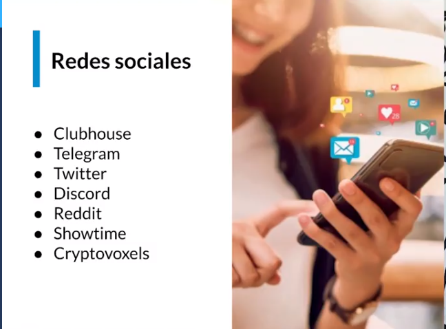
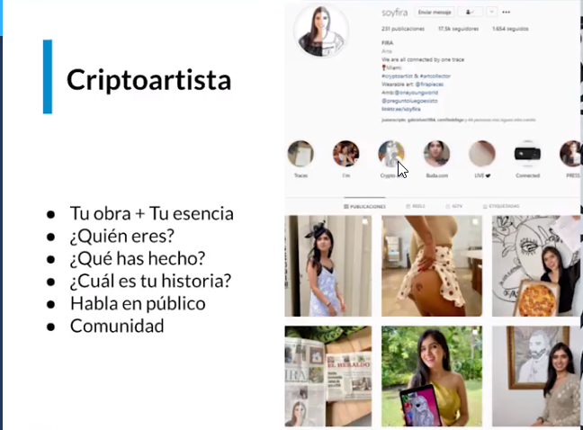

# CreacionNFTs

## ¿Cómo convertirse en criptoartista?

📚 Pasos recomendados por SoyFira para convertirte en cripta-artista:

1️⃣ Leer la Biblia de los NFTs (sin excusa)
2️⃣ Tener criptomonedas para publicar los NFTs
3️⃣ Tener una billetera (Recomendación Metamask)
4️⃣ Abrir una galería (Recomendación Opensea)
5️⃣ Mintea tu primer NFT (Publicar)
6️⃣ Vender, vender, vender (que la gente le guste tu arte)

## Enlaces 

- https://metamask.io/
- https://tryshowtime.com/
- https://opensea.io/blog/guides/non-fungible-tokens/ 
- https://opensea.io
- https://www.cryptovoxels.com/

## Cursos mejora personal 
- https://platzi.com/clases/hablar-en-publico/
- https://platzi.com/clases/marca-personal/

## Debes abrir tus 7 Redes Socilaes 

## Consejos 

## Consejo 0001 A continuación te dejo una lista de actividades que harán de tus hobbies y pasión un negocio:

- Crea tu arte.  
- Elige las obras que quieres publicar y define el formato que utilizarás (png, jpg, gif, pdf, etc.).
- Define qué plataforma (galería) te conviene y se adecua a tu proyecto.
- Crea una marca personal, acompáñala con un manifiesto y publícalo en tu página web o blog.
- Conecta con otras personas y sigue las noticias de lo que está pasando.
- Conoce lo que haces y nunca parar de aprender.

## Modelos de negocio que salen del mundo digital
> El uso de los NFT se está extendiendo fuera de las fronteras digitales, y hay tantas oportunidades para su uso como imagines. La NBA, que maneja la liga más importante de baloncesto, imaginó utilizar los NFT para crear tarjetas coleccionables que venden a través de su plataforma TopShot.

## Empresa de fondo de inversion 

- https://www.venturecapital.game/alteredgallery

