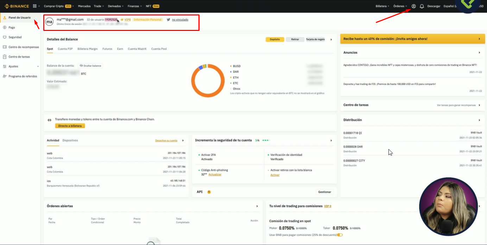
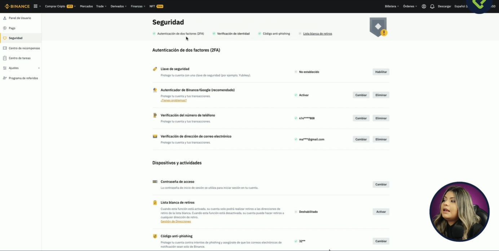
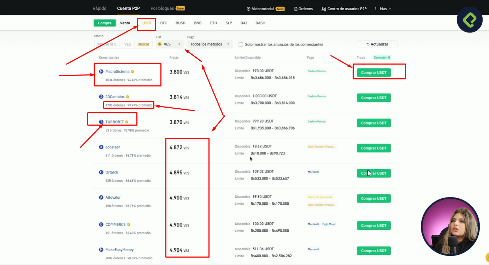
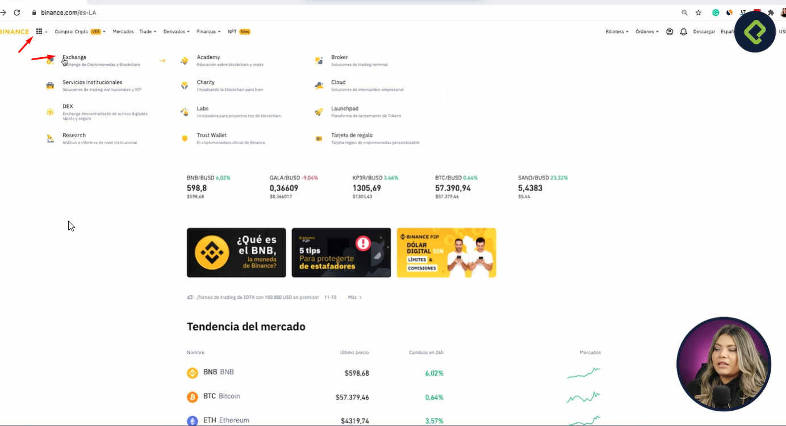
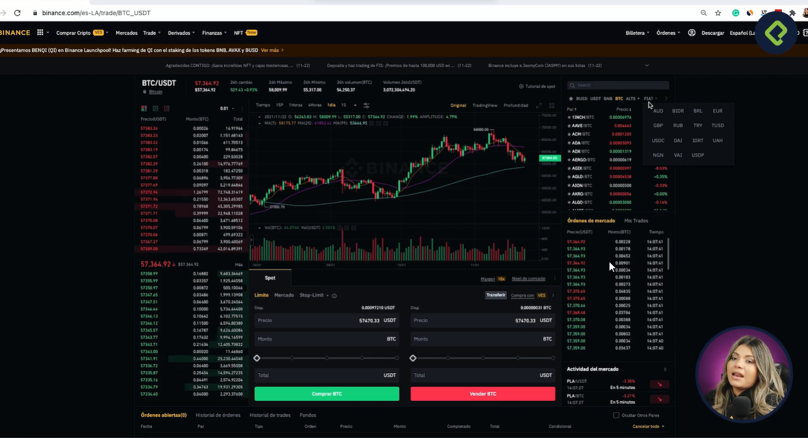
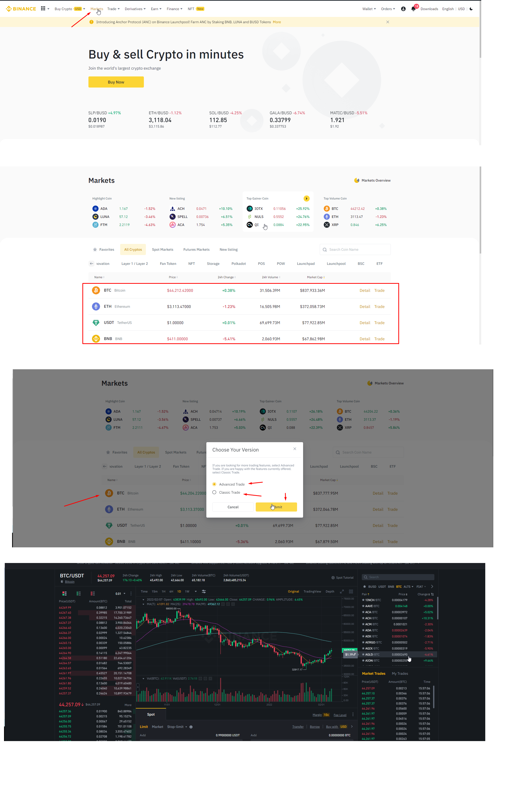
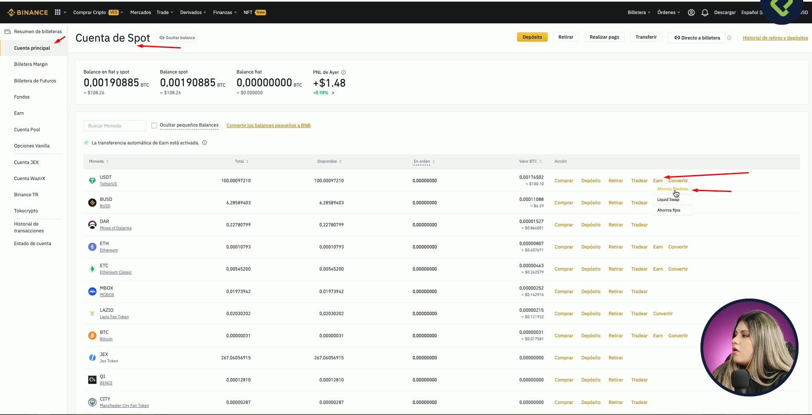
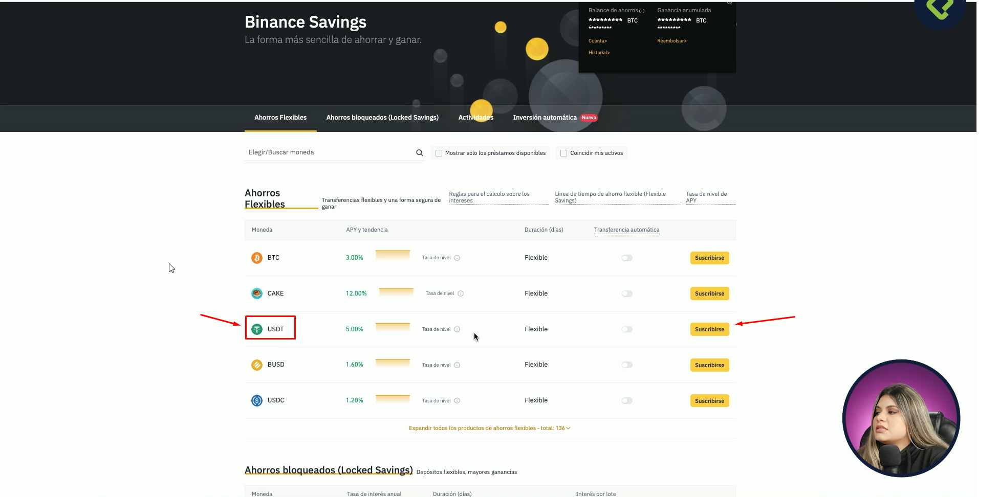
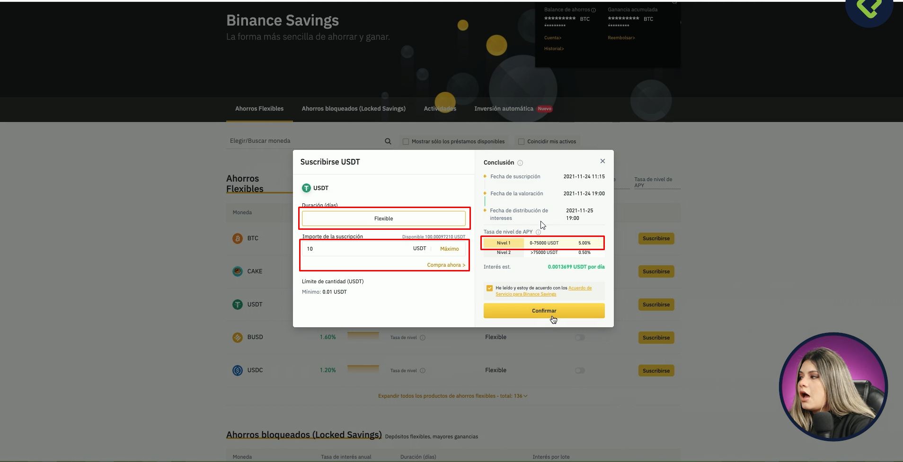

# ** 🧪Curso de Binance: Exchange de Criptomonedas 🧪**

## Clase 1: Bienvenido a Binance
**Qué es**
>Binance es una plataforma de intercambio de criptomonedas que proporciona una plataforma para 
comerciar más de 100 activos digitales. Desde 2018, es considerada la plataforma de intercambio 
con el mayor volumen comercial del mundo.
 
- Fundador: Changpeng Zhao
- Fundación: 2017
- Director ejecutivo: Changpeng Zhao (jul 2017–)
- Tipo: digital currency exchanger, mercado de bitcoin, mercado de criptomonedas y bolsa de valores
- Forma legal: sociedad de Delaware
 
## Clase 2: Registro en la plataforma
**Crear una cuenta en Binance**
- En la página o APP de Binance vamos a dirigirnos a Registrarse

**Datos que Solicitan **
- Colocar el país de residencia.
- Colocar el correo y una contraseña (Debe tener un número y una letra en mayúscula).
- Deslizamos el puzzle de seguridad.
- Colocar el código que ha sido enviado a nuestro correo.
- Completar la verificación
- Haz click en verificar.
- Llena los datos que te solicitan.
- Ingresa tu dirección.
- Verifica tu identidad con tu C.I, DNI, Pasaporte o Licencia de conducir, esta debe ser legible, correcto, sin flash, que no salga cortada. También puedes realizarlo con el código QR para realizar la verificación.
- Tomarnos una foto con el documento de identificación.
- Tomarnos una selfie y realizar los movimientos que te solicita la APP.
- El proceso de verificación es muy rápido.

**Enlace**
- https://www.binance.com/es
 
 
 > Nota: Para que sirve el referido? 
 - Cuando uno se registra e ingresa el enlace de referidos en su cuenta el que se registre con mi código va a recibir un 10% de las comisiones que me cobra binance cuando opere alguna criptomoneda y así también yo recibiré un 10% de las comisiones que cobre binance en las operaciones de mis referidos 😁.
 
 ## Clase 3:Gestión de cuenta
 
**Notificaciones**
- Actividades 
- Anuncios
- Novedades.

**Panel de usuario.**
- Opciones de seguridad
- Identificación 
- Centro de recompensas y tareas 
- Programa de referidos y control de API.

**Órdenes**
Todos los tipos de órdenes de los diferentes mercados.

**Billetera**
Acceso a todos tus tipos de billetera.

**Datos**
- Binance ID: Número que identifica tu cuenta.
- Nivel VIP: Depende del nivel de BNB que tengas.
- Detalles del Balance: Encuentras la información acerca de tus fondos.
- Cuenta P2P: Donde agregas tus datos de pago para hacer transacciones persona a persona, solo pueden estar registradas tus cuentas.
 
 
 
 
 
 ## Clase 4: Compras, depósitos, retiros y Binance Pay
 
**P2P Person to person**
- Transacción con tercero verificado por Binance, ten en cuenta que Binance siempre está monitoreando las transacciones.
- Hay dos tipos de usuarios:
- Usuarios verificados: Tienen un badge que los identifica.
- Usuarios comunes: No tienen un badge.

**Tarjeta de Crédito o Débito.**
**Compra o venta con tarjeta de criptomonedas**


 
 ## Clase 5:Mercados
 
 ```
 Qué mercados estoy segura que cuando entraste a Binance por primera vez viste esas gráficas 
 rojas y verdes subiendo y bajando y te preguntabas qué es eso pues básicamente son los 
 mercados que se encuentran dentro de la plataforma allí es donde los usuarios pueden 
 comprar o vender un activo y ese intercambio es lo que nosotros denominamos el 
 trading este tipo de transacciones pueden realizarse en mercados de criptomonedas 
 e incluso en mercados minerales 
 ```
 
 
 

 
 ## Clase 6:Trading Tools
 
 **Caracteristicas**
 - Usar binance no simplemente se trata de aprender a utilizar la herramienta en sí recuerda que Binances es un ecosistema.  
 - Binance  entre tantos productos incluye una plataforma de trading o un Exchange de criptomonedas con diversos mercados y diferentes tipos de trading 
 - Es muy similar a como cuando aprendemos a manejar un automóvil tenemos los sincrónicos y los automáticos, la base similar pero la forma es distinta y si tú vas a otro es la misma forma de manejarlo 
 - La mayoría de los trading de criptomonedas sin importar la marca detrás de ellos tienen las mismas bases y la misma usabilidad. 

**Como acceder al trading en Binance**
- Hay dos formas por el menu superior dar clic en Mercados/Escoges el Token/Excoges si intercar clasi ó avanzada / Listo te carga la grafica de velas 
 

- La otra forma es dar clic en el menu superior a la opción TRADE/classi/ 

 >Nota: 
 
- La explicación de orden OCO y Stop-Limit me pareció algo confusa, les recomiendo ampliar con la documentación de Binance que también está en español y esta muy completa.
- Ampliación orden Stop-Limit -> https://academy.binance.com/es/articles/what-is-a-stop-limit-order
- Ampliación de orden OCO -> https://academy.binance.com/es/articles/what-is-an-oco-order
 
## Clase 7: Binance Finance
 
 Binance es conodido por su traiding pero recuerda que trading es un oficio necesita tiempo y dedicación, pero binance 
 podemos generar recompensas pasivas sin tener el alto riesgo del traiding. 
 
 **Caracteristicas**
 - Podemos usar una opción de binance llamada ahorros flexibles
 - Tienes que hacerte una pregunta quieres ganar mas bitcoin ó monedas estables. 
 - Puedes ahorrar en USDT y tener ganancias en USDT pero esto es mas estable no hay flutacciones
 - Puedes ahorrar en BITCOIN y tener esas ganancias por la volatilidad recuerda la volatilidad puede ser algo negativo o positivo. 
 - Tiene comisiones muy bajas 
 
**Paso 1: **
 

**Paso 2: **
 
  
**Paso 3: **
 
  
## Clase 8: NFT

> NFT son tokens no fungibles básicamente tokens que no se pueden repetir estos pueden ser audios vídeos documentos y muchísimas más cosas que se emiten 
de la blockchain recuerda que la blockchain es un Libro Blanco donde todo está registrado y al colocar esta pieza allí tú tienes la garantía de que es 
única e irrepetible porque está emitida en un bloque único los NFT son como aquellas barajitas que utilizamos en nuestra infancia o cromos como también 
le dicen en otros países qué se colocaban dentro de álbumes estos álbumes que tenían diferentes motivos de acuerdo a la situación como por ejemplo los 
populares de los Mundiales de fútbol o de las películas del momento. 

**Caracteristicas**

> habían cromos que eran más fáciles de encontrar que otros y otros eran por supuesto más caros de acuerdo a su escasez lo mismo sucede con los NFT 
por ejemplo el cromo más caro de Messi llegó a costar aproximadamente €9,000 y este era muy difícil de encontrar así que la persona que lo tuviese 
dentro de su álbum era definitivamente muy afortunada, también el mismísimo Messi lanzó su beneficio un año que llegó a alcanzar casi los 9 millones 
de dólares en costo que es una analogía super similar a todo lo que ocurría anteriormente la misma situación de las casas y la especialidad de la del 
producto es lo que le entrega su valor además de por supuesto la superestrella que se encuentra detrás en esta clase vamos a hablar del mercado de NFT 
que se encuentra disponible dentro de Binance allí tú vas a poder comprar y vender. 
 
## Clase 9:
 
 ## Clase 10: