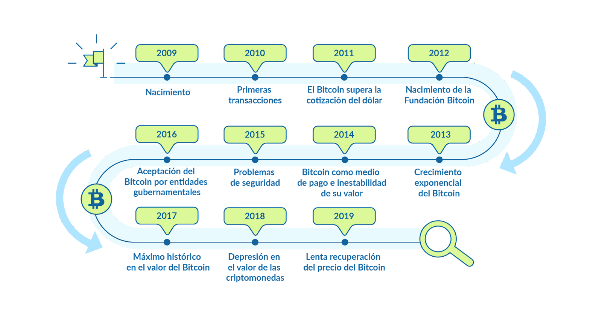
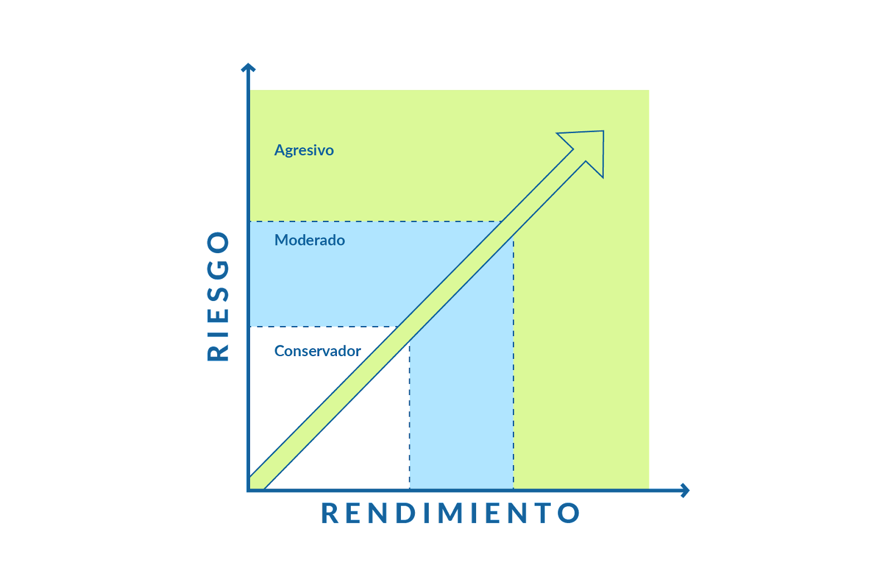
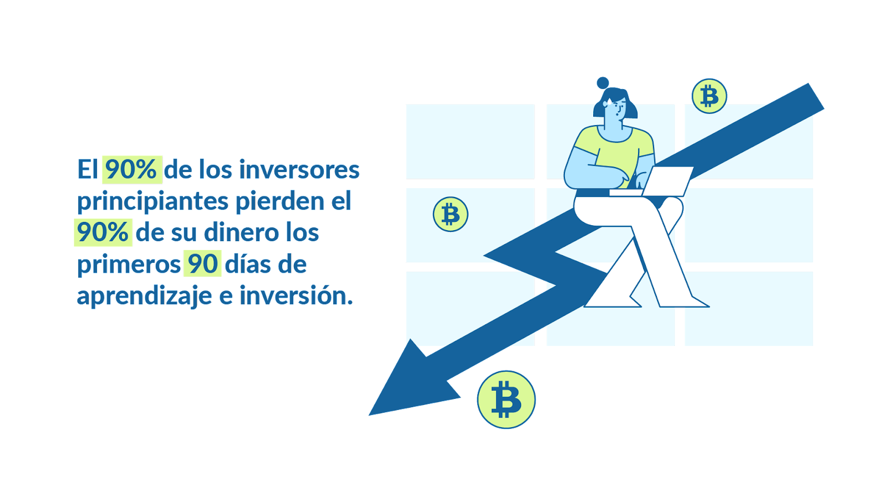

# Curso de Lectura Economía Digital: Bitcoin y Criptomonedas

## Clase 1:

## Clase 2:

## Clase 3:

## Clase 4:

## Clase 5:

## Clase 6:

## Clase 7:

## Clase 8:

## Clase 9: Almacenamiento y Seguridad 

>Tips
- Siempre utiliza un gestor de contraseña
- recuerden WIFI FREE = PELIGRO !!!
- No utilices la misma contraseña 
- Instala software de antivirus 
- Nunca instales software desarrollado por terceros 
- Utiliza billeteras verificadas y confiables
- Actualiza el software de la billetera en cuanto este disponible 
- Verifica que tu dirección publica sea la correcta cuando envias tus fondos 
- Revisa una segunda vez tu dirección publica
- Si acceder a billeteras online tenga el sertificado de seguridad
- Siempre activa la autenticación de dos pasos 
- Cuanto mas capas de seguridad utilices en tus billetera mejor. 

## Plataforma de Inversión

> Las mejores plataformas de inversión de criptomonedas son aquellas que ofrecen variedad de criptomonedas, comisiones bajas, liquidez, se encuentren reguladas por organismos de mercados financieros, además de una interfaz dinámica de análisis, operaciones y almacenamiento.

> Binance
- Es considerada la mejor plataforma de inversión de criptomonedas del mundo, 
- Además de brindar la opción de operar con apalancamiento y contar con muchas opciones para los inversores. 
- Una de las primeras en liquidez y volumen además de una gran cantidad de cripto activos financieros como opción de inversión, comisiones bajas, garantías de seguridad superior a otros exchanges, y muchas otras características que la ubican en el top.

> Bitfinex
- Una de las plataformas pioneras de inversión en criptomonedas, fundada desde el 2012 y de las más relevantes del mercado. 
- Cuenta con una gran cantidad de cripto activos financieros, así como gran liquidez y volumen. 
- Su interfaz gráfica es de agrado para los usuarios al ser completamente personalizable, 
- permitiendo la configuración de funciones y herramientas de inversión, haciendo por tanto la experiencia del inversor sencilla y satisfactoria.

## ¿Qué son satoshis?

> Un satoshi es la medida mínima en la que se puede fragmentar un bitcoin, así pues 1 bitcoin es equivalente a 100 millones de satoshis, expresado a la inversa entonces 1 satoshi equivale a 0,00000001 BTC y el nombre está asociado al creador del bitcoin: Satoshi Nakamoto, quién definió así las reglas en el protocolo inicial del BTC.

> Bitcoin es el padre de las criptomonedas, por lo tanto, todas ellas determinan su valor en referencia al bitcoin. De esta forma entender el funcionamiento de los satoshis nos ayudará a entender el valor que se les asigna a las criptomonedas y así gestionar nuestras transacciones en el mercado de forma exitosa.

## Herramienta 
https://coinmarketcap.com/converter/ 

## Clase 10:

## Clase 11:

## Clase 12:

## Clase 13: Evolución del Precio de Bitcoin y Criptomonedas

2009: Nacimiento
Nace Bitcoin, y se genera el “Bloque Génesis” o primer bloque de minado por 50 BTC. Durante ese año se registran las primeras transacciones a nivel global.

2010: Primeras transacciones
El 22 de mayo de 2010 Laszlo Hanyecz pagó 10.000 BTC por un par de pizzas, siendo una de las primeras transacciones en utilizar el cripto activo como método de pago. Además superó por primera vez los 10 centavos de USD.

2011: El Bitcoin supera la cotización del dólar
Bitcoin logra lo imposible y alcanza 1 USD de cotización, dando inicio a un gran interés por las criptomonedas y al alto nivel de volatilidad en la fluctuación del precio del activo, superando los 20 USD a mediados de año, pero debido a preocupaciones sobre la falta de marcos legales sobre este nuevo sistema monetario y la no consolidación de un mecanismo de comercio su cotización cae a valores mínimos regresando nuevamente a 2 USD.

2012: Nacimiento de la Fundación Bitcoin
Nació la Fundación Bitcoin, una organización sin fines de lucro, para promover el crecimiento de esta moneda digital. Su misión era estandarizar, proteger y promover el protocolo de código abierto. Su cotización creció lentamente durante ese año. Además, BitPay anuncia que más de 1.000 plataformas aceptan Bitcoin como método de pago.

2013: Crecimiento exponencial del Bitcoin
Coinbase anuncia un incremento considerable del volumen de transacción en su plataforma durante el primer trimestre del año, y entidades financieras comienzan a prestar su atención a la criptomoneda. Crece de forma exponencial durante un año, iniciando en 20 USD promedio de cotización y alcanzando los casi 1.000 USD antes de finalizar el 2013.

Para este momento, Bitcoin ya contaba con una gran comunidad que lo respaldaba como proyecto y tecnología.

2014: Bitcoin como medio de pago e inestabilidad de su valor
Este año Bitcoin comienza a ser aceptado como medio de pago y como activo de inversión. Empresas como Microsoft comienzan a aceptarlo como método de pago. El gran impacto en la volatilidad de los precios comienza a hacerse más notable iniciando el año en un precio cercano a los 1.000 USD y culminando debajo de los 400 USD.

2015: Problemas de seguridad relacionados con Bitcoin
Ese año se informa de varios ataques cibernéticos y el robo de Bitcoin de varias compañías de pagos. Se procede al cambio en los sistemas informáticos para dotar de mayor seguridad a la red de comercio. Afectando en efecto al precio, pues fue un año de crecimiento lento con caídas a principios de año y aumento progresivo hasta alcanzar nuevamente los 500 USD para final de año.

2016: Aceptación del Bitcoin por entidades gubernamentales
Japón decide legalizar Bitcoin como medio de pago, ningún gobierno lo había hecho hasta el momento y durante ese año comenzaron a existir a nivel mundial cerca de 500 cajeros automáticos de Bitcoin. Su cotización se mantiene en crecimiento lento pero constante iniciando el año en cerca de 400 USD y finalizando sobre los 900 USD.

2017 El máximo histórico en el valor del Bitcoin
Este es quizá uno de los años más importantes para el bitcoin y las criptomonedas, comenzó a crecer rápidamente y su evolución dejó atónitos a todos los inversores además de atraer la atención de millones de personas en el mundo.

El gobierno de Rusia anuncia la legalización y adopción del cripto activo, y tras varios eventos políticos económicos durante el primer trimestre del año (Brexit, Trump como presidente de USA, etc.) Bitcoin ya había superado el máximo histórico de 1.000 USD y comienza el camino de crecimiento impensable, iniciando por romper la barrera de los 2.000 USD a mediados del mayo superando al oro en su cotización.

El FOMO Se intensifica y Bitcoin registra los 19.900 USD antes de culminar el año registrándose como el máximo histórico de las criptomonedas, mostrando al mundo su potencial de crecimiento.

Fuente: Statista Es – Ripple, la criptomoneda que más creció en 2017

En el momento de mayor euforia de las criptomonedas, vimos rentabilidades de hasta 200% en una sola semana en las criptomonedas top.

Fuente: Coinmarketcap Historial Snapshot 17 de Diciembre de 2017

2018 Depresión en el valor de las criptomonedas
El mercado bajista dio inicio y comenzó a ser el protagonista, en el primer trimestre Coincheck una de las plataformas más grandes de inversión de Japón sufrió un ciberataque, siendo uno de los ataques informáticos más grandes de la historia y representando más de 400 millones de dólares en pérdidas en ese momento. Esto intensificó el panorama y para finales de año el Bitcoin había realizado un fuerte retroceso en el precio hasta 4.000 USD en promedio.

2019 Lenta recuperación del valor del Bitcoin
Después de meses en mercado bajista, 2019 fue el año de la recuperación. Si bien el precio no ha podido superar los máximos históricos el mercado de las criptomonedas hasta la fecha, fue en recuperación y el uso del ecosistema comenzó a ir en aumento. Iniciando el año sobre los 3.000 USD promedio hasta alcanzar nuevamente los 10.000 USD.

Resumen
Bitcoin en el tiempo, sin importar las fluctuaciones, ha demostrado ser un cripto activo con resultados de largo plazo sólidos y consistentes.

## Clase 14:  Ballenas vs. Retail
¿Qué son Ballenas y Traders Retail?
Las ballenas son inversionistas con alto poder adquisitivo y amplio recorrido en el mundo de las inversiones, conociendo por tanto los patrones de funcionamiento de los activos financieros, y elevando así las probabilidades de éxito en sus transacciones.

Debido al gran volumen de negociación, las ballenas pueden afectar en gran medida el comportamiento del precio de un cripto activo. En los mercados financieros tradicionales al ser centralizados no hay acceso para que todas las personas puedan divisar las transacciones realizadas. Sin embargo, en el ecosistema de las criptomonedas existen herramientas que nos permiten ver los movimientos de las ballenas, ayudándonos a entender cuáles son sus intereses en un cripto activo en particular y así accionar en mayor probabilidad a favor del movimiento del precio.

Los retail traders, en cambio, son inversionistas individuales o minoristas y buscan generar rentabilidad a partir de sus movimientos en el cripto mercado. En conjunto su volumen de negociación es muy bajo y suelen tener una mentalidad de inversión de corto plazo lo que los lleva a tener una baja diversificación y gran aversión al riesgo por lo tanto muy pocos logran alcanzar el éxito en el mundo de las inversiones.

BitInfoCharts
Esta herramienta nos permite visualizar la distribución de riquezas en Bitcoin, y podemos ver como de los 18 millones de bitcoins minados hasta el momento menos de 200 mil direcciones de bitcoin en el mundo cuentan con más del 80% de la totalidad del activo financiero.

## Clase 15:  Tipos de Inversores

Inversor Intradía
Su objetivo es aprovechar micro movimientos del precio en temporalidades bajas, de esa forma puede abrir y cerrar varias operaciones en un mismo día, buscando beneficios pequeños que sumen al final de la jornada.

Los inversores que operan bajo esta técnica suelen enfocarse en la acción del precio por encima del potencial del cripto activo en el largo plazo. Además, los inversionistas profesionales, cuentan con sistemas automatizados que les permiten gestionar su portafolios y optimizar sus procesos.

Inversor Swing
Su objetivo es aprovechar los movimientos tendenciales en temporalidades medias, y sostener operaciones durante días e incluso semanas, buscando beneficios considerables, pero en menor medida pues su enfoque no es visualizar el mercado en todo momento sino aprovechar los grandes movimientos. Una buena diversificación y gestión de riesgo es prioridad para un inversor de este perfil, además de enfocarse en el potencial de mediano plazo del cripto activo.

Inversor de Largo Plazo
Un inversor de largo plazo, estudia el potencial del activo financiero en el tiempo. Su enfoque no se encuentra en puntos medios del precio sino en que pueda perdurar y generar beneficios pasados los meses e incluso años además de diversificar su portafolio e ir agregando activos que incrementen el valor de su capital.

¿Cuál perfil elegir?
El objetivo principal de cualquier inversor es generar beneficios, comprando y vendiendo cripto activos o viceversa.

El principal problema radica en que la mayoría de las personas están enfocadas en encontrar beneficios en el corto plazo, y esto no está directamente relacionado con el tipo de inversor sino con la mentalidad errónea. 
Pero el mercado siempre está ahí para recordarte que esto no es un juego, es una profesión en la que debemos contar con un plan, metas, y estrategia. 
Así que ¿cuál perfil debo elegir?

Elige un perfil que se adapte a tu personalidad, 
así como tus objetivos e intereses con el cripto mercado, sin embargo, cada uno de ellos requiere una enorme 
cantidad de tiempo, estudio, herramientas, disciplina, enfoque y estrategia que nos permita ser consistentes.

¿Qué tipo de inversor te gustaría ser? ¿Por qué?

## Clase 16: Portafolios de Inversión

### Un portafolio de inversión conservador 

Minimiza al máximo las posibles pérdidas, a cambio de obtener beneficios consistentes en el tiempo y en el peor de los casos la pérdida total no suponga un gran daño al capital inicial.

La diversificación en este tipo de portafolios es clave, pero también los cripto activos, por lo que las mejores opciones siempre serán cripto activos sólidos y con trayectoria en el tiempo además de un nivel de volatilidad normal respecto al ecosistema, que no suponga cada transacción más de 1% de riesgo sobre capital total y de una posible proyección de beneficio que supere al menos tres veces el riesgo.

- Ejemplo Invertir en ethereum 

### Portafolio de Inversión Moderado
En un portafolio de inversión moderado dentro de un marco lógico el objetivo es alcanzar una rentabilidad atractiva asociada a un riesgo moderado. Es decir, la aversión al riesgo aumenta por transacción sin embargo la relación beneficio riesgo debe mantenerse o superar al perfil de riesgo conservador.

- Ejemplo Invertir en SLP  

### Portafolio de Inversión Agresivo

Inversores experimentados, con gran recorrido y conocimientos crean este tipo de portafolios. En la mayoría de los casos con herramientas automatizadas que les permiten controlar a detalle la aversión al riesgo y también el sesgo emocional. Además de ello una diversificación amplia, así como cripto activos con mayor nivel de volatilidad. Normalmente son portafolios con un perfil de inversor de intradía o corto plazo pues el nivel de riesgo es bastante amplio respecto al capital inicial y el objetivo principal es aprovechar la mayor cantidad de movimientos en el mercado para generar en mayor probabilidad más beneficios a partir de ello.

- Ejemplo Invertir en Axies

 

## Clase 18: Gestión de Riesgo + Regla 90/90/90

> Regla del 90/90/90

- Sí, es difícil de comprender, también puede ser duro leerlo pues la mayoría de los inversores principiantes buscan resultados exponenciales inmediatos o en el corto plazo, pero justo esta mentalidad es la que lleva a todos a ser parte de las estadísticas que nos muestran las plataformas de inversión.

- Ser inversor requiere tiempo de estudio, disciplina, una metodología comprobada en el tiempo, gestión monetaria, pero también gestión emocional y mucha paciencia para continuar avanzando. Seguir el camino correcto de aprendizaje nos llevará a salir de las estadísticas y ser parte de la minoría que logra generar resultados increíbles y consistentes en el tiempo.

### Algunas recomendaciones para que gestiones tu riesgo y puedas preservar tu capital son:

- No arriesgues más de 1% de tu capital de inversión por transacción.
- No expongas tu capital de inversión a más de 3% de riesgo diario.
- Nunca olvides proteger tu operación con un Stop Loss.
- Siempre busca una proyección de beneficio superior a tres veces la pérdida de tu operación.
- Lleva siempre una bitácora de trading en dónde registres cada una de tus operaciones.
- Opera de forma objetiva, si sientes que estás siendo impulsado por emociones, aléjate del mercado.
- Ten en cuenta que ni el inversor más experimentado es inmune a las pérdidas. Siempre estarán presentes, pero tu objetivo es que sean siempre - de la misma medida y puedas ser consistente al final de un período de tiempo.
- Siempre sigue tu plan e instrucciones, no dejes nada al azar.
- No permitas que la avaricia y el exceso de confianza se apoderen de tu operativa.

