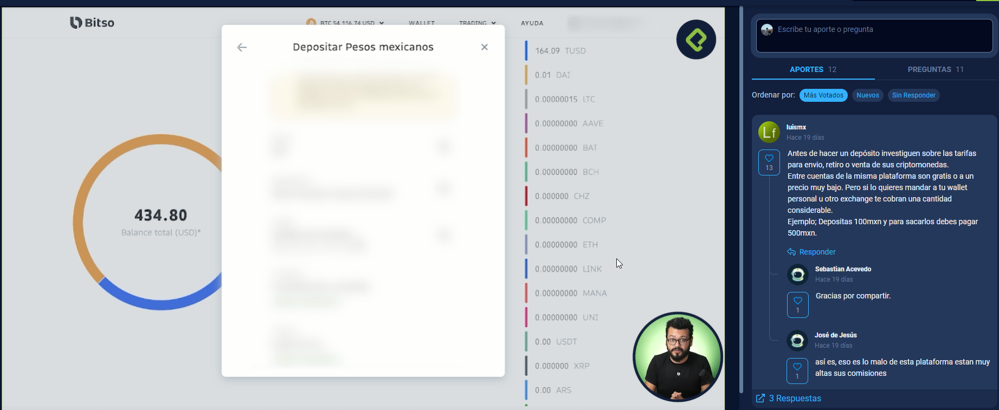

# 💡 CursoBitsoExchangeCriptomonedas 💡

## Clase 1: Bienvenida 
Profesir Elian Huesxa @cristpereirag 

**Ques es Bitso**
- Es una casa de cambio de america latina
- En pocas palabras es un Exchange
- Mas de 3 Millones de usuarios 
- Operan Mexico, Argentina, Brazil y Colombia
- Se puede usar como remesas
- Como inversi¨®n o Ahorro 

## Clase 2 - 3: Abre una cuenta en Bitso

Existe dos Opciones
 - Personal    -> Se recomienda abrir cuenta aqui 
 - Empresarial 

**Datos**
- https://bitso.com/register 
- Necesitas Correo 
- Generar contrase?a 
- Al registrarte te genera un c¨®digo que debes validar 

**Datos Personales**
- Formulario [nombre, apellido, segundo apellido, Nacionalidad, Pais que naciste, Estado donde naciste, fecha de naciiento, Eres PEP-> Persona politicamente expuesta-> Marcas que no, Sexo Legal, Ocupaci¨®n, Cual es el origen de los fondos, (Ahorros de mis salarios), CURP -> Varia en paises, Numero Celular ]

## Clase 4: Realiza tu primer dep¨®sito

> Nota: Antes de hacer un dep¨®sito investiguen sobre las tarifas para envio, retiro o venta de sus criptomonedas.

- Entre cuentas de la misma plataforma son gratis o a un precio muy bajo. 
- Pero si lo quieres mandar a tu wallet personal u otro exchange te cobran una cantidad considerable.
- Ejemplo; Depositas 100mxn y para sacarlos debes pagar 500mxn.

## Clase 5: Realiza conversiones utilizando Bitso App

**CONSEJO PARA EVITAR ALTAS COMISIONES AL RETIRAR CRIPTO A OTRAS PLATAFORMAS**

- Si ya est¨¢s bien relacionado con la plataforma de BITSO y quieres explorar otras opciones como las que ofrecen plataformas como Binance (Staking, Pools, etc) 
- lo que yo hago es comprar XRP en BITSO y transferirlo a mi wallet de cualquier otra plataforma esto por qu¨¦ la red de Ripple no cobra comisi¨®n, 
- ya que las tengo las cambio a la criptomoneda que deseo usar en determinada plataforma.

PD: Bitso esta extremadamente verde.
Solamente esta disponible para mexico, brazil y argentina.

Esta muy bueno como alternativa, pero segure usando Binance.

## Clase 6: Realiza conversiones en Web

- PD
- La comision que te cobra el exchange por hacer la transferencia a otro exchange o wallet te lo indican antes de hacer la transaccion. 
- Y normalmente esa transaccion varia dependiendo de la red.
- (Opinion personal): La red mas economica en fee para pasarte tus criptos de exchange a exchange es la red de Tron.
- Usualmente te cobran aproximadamente 1 Tron o menos para pasarlo de exchange a exchange.
- Me ha servido para pasar de Binance a KuCoin

## Clase 7: Realiza operaciones en Bitso Alpha App
En pocas palabras:

Bitso App == Data de la Wallet

Bistso Alpha App == Transacciones (¨®rdenes) de mercado

Bitso Cuenta con 2 Apps,Bitso y Bitso alfa para m¨®vil, en la primera encontraras la inforacion de tu Wallet, en la segunda donde podr¨¢s hacer tus ordenes de mercado.