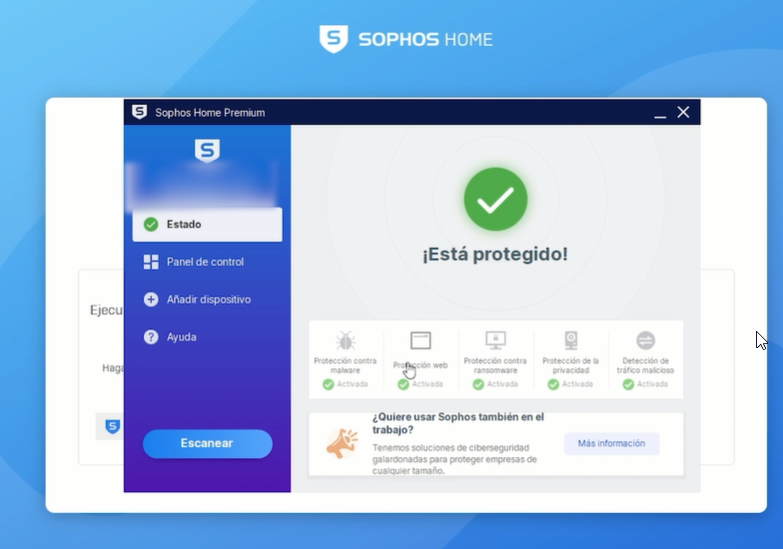
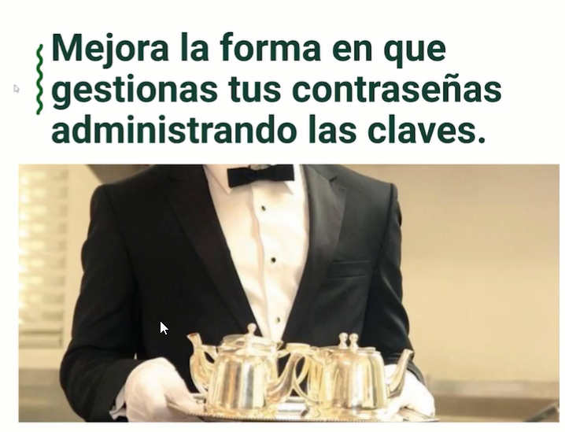
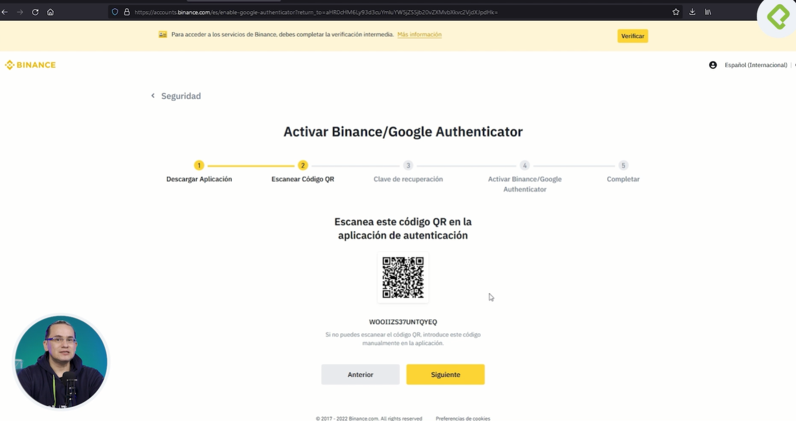
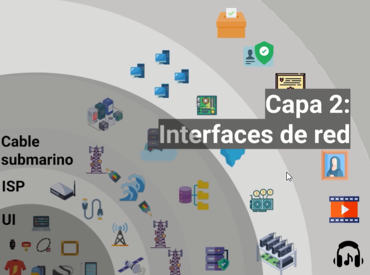
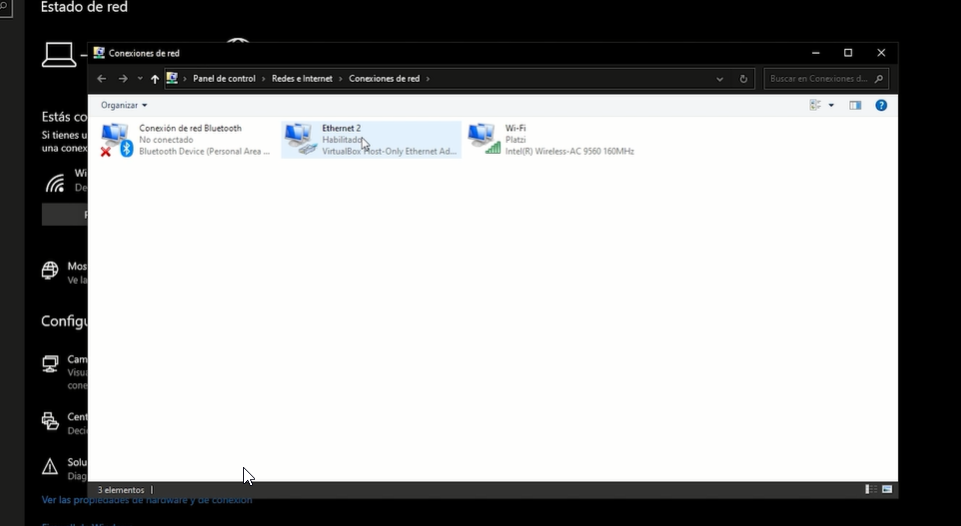
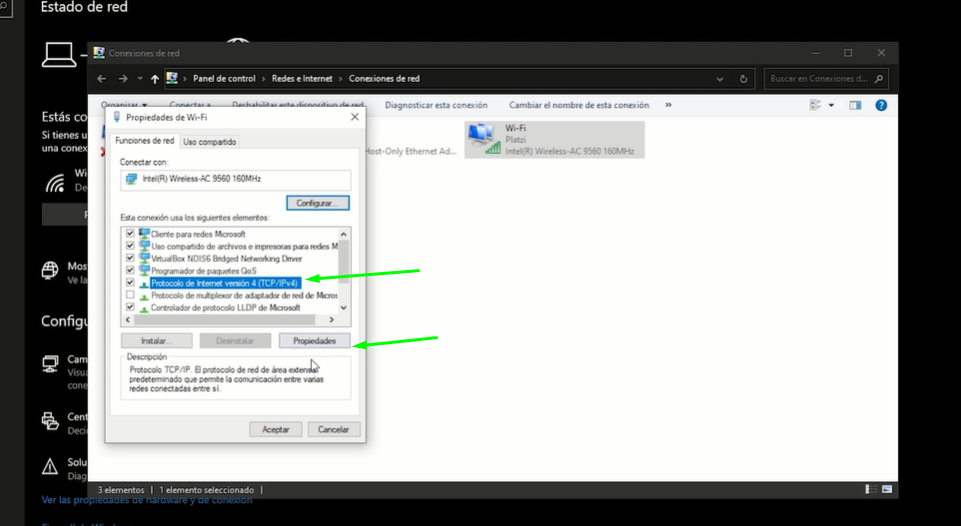
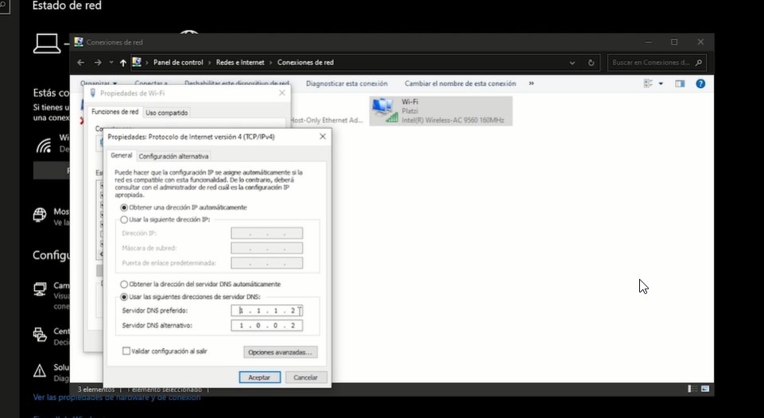

# Curso de Seguridad para Usuarios de Criptomonedas

## Clase 1: La importancia de la seguridad
**Notas**
- No debes tener software pitara instalado en nuestro equipo `Ningun software`
- Validar los sistemas de seguridad de tu equipo 
- Limpia tus equipos de posibles amenazas como programas piratas o malware. Deberás siempre mantener tu sistema operativo actualizado para evitar vulnerabilidades. 
- La importancia y cultura de mantener nuestros equipos actualizados para el beneficio de nuestra seguridad.
Creando conciencia y cultura
- Es vital la seguridad en nuestro equipos no nada mas para gestionar criptos 
- Si tú te conviertes en tu propio banco la seguridad de tus activos solo está a cargo de ti mismo

## Clase 2: Antivirus y personal firewall

> Hoy en día los anti-virus son mucho más que un simple programa para analizar USBs o el correo, son mucho más. Brindan una protección integral del sistema que se actualiza con mucha frecuencia y funciona incluso con IA para detectar amenzas de todo tipo.

**Notas**
- Sophos -> Antivirus reccomendado -> https://home.sophos.com/es-es

## Clase 3: La importancia del administrador de contraseñas

**¿Por qué debemos utilizar un administrador de contraseñas?**
> Los administradores de contraseñas están para guardar cientos de contraseñas por nosotros. Se trata de software especializados en seguridad a los cuales no debes temer y puedes confiar en que mantendrán seguras tus contraseñas.

- Solo deberás recordar una “Contraseña Maestra”, la cual utilizarás para acceder a todas tus otras contraseñas. 
- Es recomendable que la misma posea entre 15 y 20 caracteres y la recuerdes muy bien, dado que, dependiendo el administrador que uses, puede no ser posible recuperarla. Solo deberás recordar una contraseña por el resto de tu vida.

**Notas**
- Administrador de Contraseñas -> https://bitwarden.com/
- keepass -> https://keepass.info/

## Clase 4: Autenticación en 2 pasos

**Doble factor de autenticación**
> 2FA (Two Factor Authentication) es un mecanismo de seguridad donde enlazamos nuestra cuenta de una aplicación, a un dispositivo físico que nos entregará un PIN para autenticarnos en el sitio que deseamos ingresar.

- Dicho PIN suele ser de 6 caracteres numéricos y expira en cuestión de  minutos.
- Debemos el código en la aplicación que nos lo solicita para concretar la autenticación. 
- Si no poseemos el dispositivo físico con nosotros, no podremos autenticarnos en la app.

- Puede parecer algo incómodo tener que tener siempre en tus manos ese dispositivo, casi siempre un smart phone. 
- También es molesto tener que recurrir a este PIN para ingresar, hace más lento el proceso de login. 
- Pero, es necesario buscar esta incomodidad, no debe ser cómodo y rápido ingresar a tu cuenta de Binance o cualquier app tan importante.

## Clase 5: ¿Qué es el DNS?

**Qué es un Servidor de nombres de dominio**
Los DNS (Domain Name System) son servidores especializados en traducir URL a su IP correspondiente.

`Por ejemplo, cuando ingresas a https://platzi.com, un servidor DNS traducirá dicha URL a la IP que le corresponde y que se utilizará para lograr localizar el servidor web donde se encuentra la página de Platzi, el mismo enviará los archivos estáticos que construyen la página al cliente web con el cual realizaste la solicitud.`

**Configuración de DNS**
- Por defecto, los proveedores de internet configuran sus propios DNS que funcionan muy bien para la gran mayoría de sus usuarios que desconocen lo que es un DNS y su funcionamiento. 
- Este es el servidor DNS al cual apunta tu computador y usará para resolver cualquier página web.
- Sin embargo, puedes modificar los DNS y utilizar unos de tu preferencia que sean más veloces y seguros.
- Empresas como Cloudflare y Google ofrecen muy buenos DNS que puedes implementar libremente y de forma gratuita. 
- También existe OpenDNS como otra alternativa que ofrece recomendables DNS.
- En todo computador puedes modificar los DNS si accedes a las opciones de red, sin importan tu sistema operativo. 
- Asimismo, puedes modificar los DNS accediendo a las configuraciones del router de tu hogar para que todos los dispositivos que se conectan al Wi-Fi tengan una protección extra.

## Clase 6: Tener un router seguro
**Modem vs. Router**

No, no es lo mismo un modem y un enrutador. En pocas palabras, el modem es el encargado de proporcionar acceso a internet, mientras que el router permite la conexión simultánea de N cantidad de dispositivos para darle a todos ellos acceso a internet y “enruta” o dirige todos los paquetes al dispositivo que lo solicitó.

Por ejemplo, si tienes 10 dispositivos conectados a la red Wi-FI de tu hogar, con tu computador personal accedes a https://platzi.com y el router se encarga de que esa información le llegue a ese dispositivo y no a otro.

Hoy en día, no suele haber solo un dispositivo en el hogar, por lo que la mayoría de las personas tiene routers para darle conexión a internet a todos los dispositivos. Por supuesto que, a más cantidad de dispositivos, más se consumirá el ancho de banda y más lenta será la conexión en la red.
