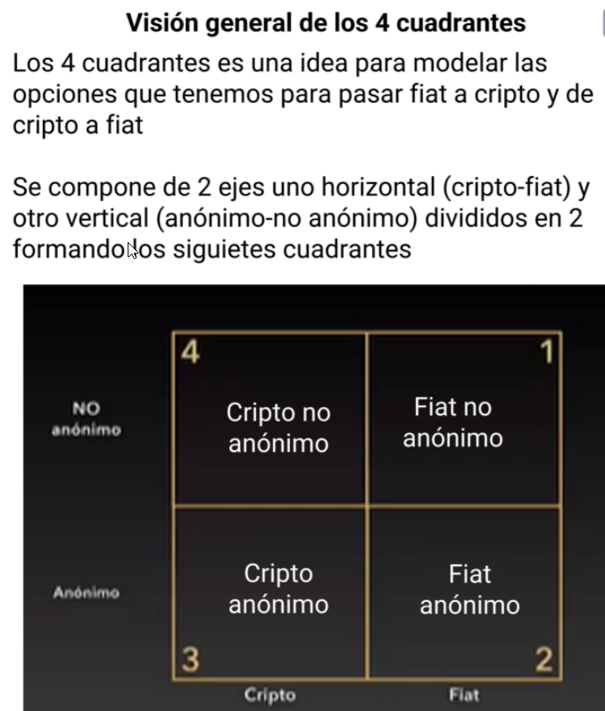

# Cuadrante de Dinero de Bitcoin y Criptomonedas
En este curso aprenderás a entender como funciona el ecosistema monetario dentro de las criptomonedas, partiendo del hecho en que existen diferentes métodos para pasar de moneda local a criptomonedas y viceversa.

Gestionar tu dinero y herramientas entre los diferentes cuadrantes.
Entender qué herramientas pueden ayudarte a mover en diferentes cuadrantes.
Entender los cuadrantes monetarios que mueven las criptomonedas.

Maestro -> Joaquín Moreno Founder en BtcenEspanol

## Clase 1: Visión General de los Cuadrantes

Los 4 Cuadrantes es una idea para modelar las opciones que tenemos para psar fiat a cripto y de cripto a fiat 

1- No anónimo - > Fiat.
2- Anónimo - > Fiat.
3- Anónimo - > Crypto.
4- No anónimo - > Crypto.

## Clase 2 - 3: Cuadrante 1 - Bancos

Es el cuadrante que estamos todos es el sistema bancario tradicional. 
> Abarca a los bancos y todo el sistema bancario creado en función de las normativas KYC y AML donde la tendencia parece ser aumentar las restricciones para transferir dinero de frontera a frontera

**Politicas** 
KYC = Know Your Customer
AML = Anti Money Laundering

** ¿ Has tenido alguna limitación del cuadrante 1 ? **

## Clase 4: Cuadrante 2 - Efectivo

- Las transacciones en efectivo son anónimas, exceptuando algunos casos, 
- No hay un historial de la transferencia de los billetes en circulación 
- por esta razón el cuadrante 1 restringe su uso y ahora con sus CBDC (moneda digital emitida por una entidad bancaria) intenta trazabilidad toda operación

**Caracteristicas**

- Trazabilidad: Permiten registrar la trayectoria del dinero.
- CBDC: Las monedas digitales emitidas por un banco central.
- KYC: Know Your Customer
- AML: Anti Money Laundering

## Clase 5: Cuadrante 3 - Cripto-Anónimo

> Son todas esas herramientas que te permiten operar con criptomonedas de forma anónima, los demás van a ver tu operaciones sin saben quien eres

El objetivo de la privacidad es evitar que nuestros datos e información pudieran filtrarse. Sin embargo, el anonimato evita que un tercero pueda saber quién está detrás de una acción determinada.
La trazabilidad permite registrar la trayectoria del dinero.

**Ejemplos**
El uso de hardware wallets y plataformas P2P sin KYC para la gestión e intercambio de criptomonedas puede ser un ejemplo 
de este cuadrante, aunque el uso de hardware wallet en un futuro no signifique que sea anónimo debido a la posible 
implementación del protocolo AOPP (Address Ownership Proof Protocol) por parte de algunas marcas de hardware wallet .

El anonimato es cuando quieres vea la actividad que haces, pero no quieres que eres tú el que lo haces.
La privacidad es cuando haces algo para tí o para un grupo de personas que tu decidas añadir.

## Clase 6: Cuadrante 4 -  Cripto-KYC

Son herramientas que permiten pasar el dinero FIAT a cripto como todo Exchange que solicite tu información personal

## Clase 7: Flujo de Banco a Cripto-NoAnónimo

Dice mucho pero no dice nada 
> PD:
- Un broker es mas caro que un  exchange 
- 

## Clase 8: Vender Cripto a cambio de moneda fiat no-anónima

Si deseas holdear alguna criptomoneda y luego pasarlo a dinero Fiat, se pueen hacer de tres formas: 

1.- Mediante un exchange o un broker ya que actuan como un termediario
2.- Segundo mediante P2P, es decir desde persona a persona, 
3.- Servicio de un tercero pero debes identificarte que por medio de un ticket vendes tu cripto por un bien  

**oferta y demanda**
- La pones en venta y esperar a que alguien lo quiera comprar.
- Cuando alguien hace la compra se avanza en el proceso.
- Dependes EXCLUSIVAMENTE del mercado, como todo lo que funciona a nivel global.

## Clase 9: De Cripto a Fiat Anónima y viceversa

- Es un tipo de transacción donde es presencial 
- Se paga un precio superior 
- Riesgo en logitica se puede perder el dinero o ser dinero robado 
- Usar sericicios reversibles 

## Clase 10: De Cripto NO-Anónimo a Anónimo

