# Curso de DeFi Introducción a Inversiones en Finanzas Descentralizadas

## Glosario de Terminos 

[Glosario de Terminos](./info/glosariocursodefi.pdf)

> DeFi: Ecosistema financiero que usa blockchain para dar valor a productos o servicios. 
        Una de sus características es no depender de una autoridad.
		
> Finanzas Descentralizadas o DeFi es una nueva forma de entender las creencias que sostienen al sistema financiero actual.		

> DeFi significa Decentralized Finance, es decir aplicar la tecnología de blockchain a productos y servicios financieros. 

## Elementos para una nueva forma de entender las finanzas:

- Funcionamiento.

- Gestión de riesgos.

- Comportamiento financiero.

## Historia y origen

**¿Por qué nace DeFi?**

**Problemas en las finanzas tradicionales:**

- No existe transparencia de la información financiera.
- No existe una alta interoperabilidad a nivel internacional entre instituciones financieras.
- Centralización de instituciones financieras y poder financiero.

**Soluciones de valor:**

- Cualquier persona puede auditar smart contracts y revisar balances de carteras de los proyectos DeFi.
- Es posible transferir cualquier tipo de valor representado dentro de Blockchain de forma casi inmediata a cualquier parte del mundo.
- No existe un punto central único y unilateral para crear, almacenar o distribuir valor.

** Historia de DeFi:** 

- En 2009 surge el PDF “Bitcoin: A peer to peer cash system” y nos hizo ver que era algo asombroso.
- Luego con proyectos como MakerDAO que podíamos estabilizar la volatilidad de activos. Conociendo el Stablecode.
- En 2018 con proyectos como UniSwap nos dimos cuenta que podíamos intercambiar de forma completamente descentralizadas tokens o criptomonedas.
- 2020 el verano DeFi, fue cuando se consolidaron muchas inversiones dentro del ecosistema conllevando a un explosivo crecimiento.

** ¿Por qué se abrió un nuevo camino en 2015? **
Para proponer 4 principales formas de entender el dinero:

- Método de pago.
- Unidad de cuenta.
- Mercancía
- Depósito de valor (hay gran debate al respecto)

> El mercado es un mercado de oferta y demanda puramente, eso conlleva una alta volatilidad. 
> Desde 2015 con proyectos como MakerDAO podíamos estabilizar el precio.
>Stablecoins: una nueva forma de transferir valor.

****¿Cuál es la propuesta de innovación de las Stablecoins?

- Sin fronteras.
- Alta liquidez.
- Descentralizado.
- Transparente.
- Auditable.
- Colateralizado.

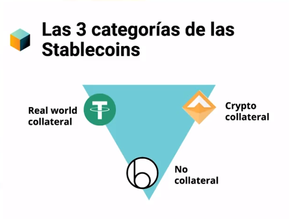

**Las 3 categorías de las Stablecoins:**
- No colaterizados: Un sistema que funciona de forma automática para estabilizar la compra venta de este tipo de activos para tener un efecto inflacionario y deflacionario y dejar que el activo sea estable. Es decir matemáticas para estabilizar el precio.
- Colateralizado en el día real: Tether tiene reservas en bancos “x” cantidad de dólares físicos contra “x” cantidad de tokens creados en la blockchain.
- Colateralizados con cripto: Que están garantizados a las mismas criptonas que operan dentro de un blockchain.

**¿Qué es un colateral**

> Es un activo que sirve como garantía frente a la concesión de un crédito, una emisión de bonos o cualquier otra operación financiera.

**¿Qué es el dinero?**

- Deuda o promesa de pago.
- Expresión de valor.

## DeFi vs. trading

**¿Qué es el trading?**

Es comprar y vender dentro de un mercado.

**¿Cuáles son las principales diferencias entre Trading y DeFi?**

- Trading: “¡Ganaré dinero cuando venda a un precio!”

- DeFi: “¡Mientras más tiempo estén trabajando mis criptos más beneficios tendré!”

- El trading es principalmente especulativo, las DeFi se basan en el crédito.
- El trading utiliza la moneda como mercancía, las DeFi utilizan como mercancía el tiempo, es decir, ya que es un crédito.
- Los beneficios en un DeFi pueden ser menores pero son menos volátiles, en el Trading estas expuesto a mucha mayor volatilidad de los beneficios esperados. 
 
> 👋🏼 HODL es como se conoce al acto de conservar tus criptos a largo plazo. Es una variación de la palabra en ingles hold que significa retener.

**¿Cómo usar tus criptos? Ejemplos** 

- Maker: Si dejas tus USDT cuando regreses obtendrás beneficios a través de un stability fee.
- AAVE: Si dejas acá tus USDT puedes prestarles a otras personas y obtener un interés.
- yearn.finance: Deja tus USDT y nos encargaremos de invertirlo en todos los protocolos de DeFi.

** Diferencias entre trading y DeFi:**

- En trading los beneficios son únicamente sobre la especulación del precio de la criptomoneda. Mientras que en DeFi los beneficios son con el paso del tiempo.
- En trading el mercado es de oferta y demanda. Mientras que en DeFi el mercado es sustentado en el crédito.
- En trading el uso es únicamente como mercancía. Mientras que los activos DeFi son un medio, no un fin como mercancía especulativa.

## Economía sustentada en crédito

> DeFi: economía sustentada en crédito
> La construcción de una nueva economía dentro de blockchain
> Las stablecoins impulsaron la creación de “market moneys”

**¿Cómo se comenzó a crear la economía basada en el crédito? A través de las stablecoins**

>Una stablecoin es un activo que tiene el mismo precio referenciado a la moneda Fiat, 
más del 90% a los dólares. En este caso DAI tiene un comportamiento similar al precio del dólar

>Todo esto funciona a través de cambiar el paradigma y la propuesta de un banco central a un protocolo. 
> En este caso se conoce como Maker Protocol, Maker DAO está detrás de ello

**Proyecto en Etherium EIP - 1599**

- Gracias a este protocolo se creará verdaderamente las condiciones adecuadas para una economía de crédito.

- Antes de la actualización la emisión era ilimitada por lo tanto el efecto inflacionario era bastante.

- Ahora con el cambio el efecto es deflacionario.

**Ejemplo**
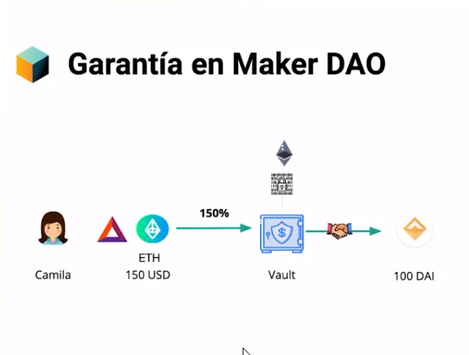

**Ejemplo**
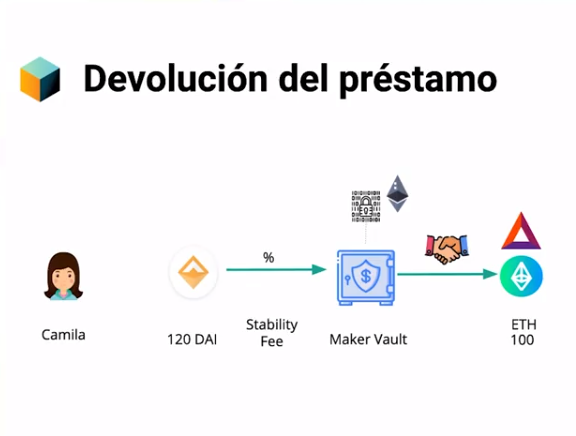

**Ejemplo**
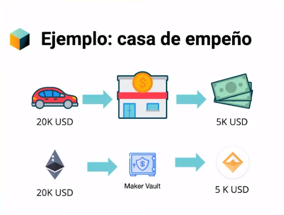

**Ejemplo**

## Herramientas 
- https://aave.com/ 
- https://docs.makerdao.com/
- https://yearn.finance/ 
- 

## ¿Qué es un token?

> Un activo es un recurso con valor que alguien posee con la intención de que genere un beneficio futuro ( sea económico o no)

### ¿Cómo se representa un activo dentro de blockchain?

> Se representa a través de los tokens.

### ¿Qué es un token?

> Representación de valor actual.

**Ejemplos: Fichas de casino, Gift Cards**

> La representación de un token está explícitamente plasmada en el código de un smart contract dentro de la tecnología de la Blockchain.

### Tipos de tokens y Crypto:

- Store of value: Bitcoin.
- Stable coins: Tether, DAI. USDT, etc.
- Exchange tokens: UNI, BNB, SUSHI, CAKE, etc.
- Utility Tokens: LINK, FIL, etc.
- NFTs: Cryptokitties, Axie Infinity, etc.
- Smart Contracts: ETH, TRON, etc.
- Digital Currency: XMR, XLM, LTC, etc.

### Definición entre layes e infraestructura:

- Una criptomoneda corre dentro de la primera capa (protocolo de consenso, redes distribuidos, herramientas criptográficas, cadena de bloques).
- Dentro de la segunda capa viven “X” cantidad de tokens habidos y por haber.
- En la tercera capa hay una interacción entre plataformas

### Diferencias entre tokens y criptos:

- Una criptomoneda es independiente, mientras que un token necesita una criptomoneda.

- Una criptomoneda no necesita un Smart Contract, mientras que el token necesita de un Smart Contract

- Una criptomoneda opera en la primera capa del protocolo e consenso, mientras que un token operan en la segunda capa de Smart Contracts.

- La función de la criptomoneda es limitada, mientras que los tokens pueden representar cualquier símbolo o valor.

.
### 🙋Criptomonedas (proyectos) interesantes:

COMP
CAKE
AXS (Axie Infinity)
PVU (Plants vs Undead)

## Plataformas de lending money markets

**¿Qué es un money market?**

Es un mercado monetario o de dinero es el conjunto de mercados financieros independientes, 
pero se relacionan, en los que se intercambian activos financieros. 

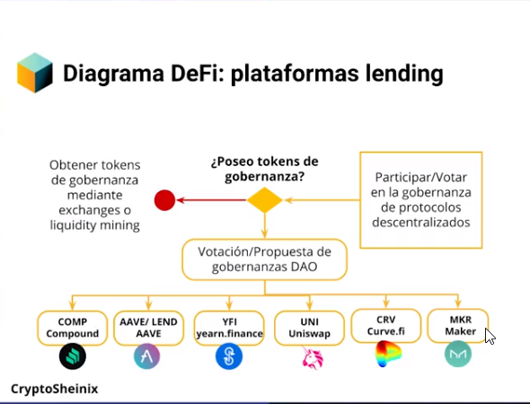

**Total value locked: lending** 

- AAVE: 10.75 B
- Compound: 6.83 B

**¿Cómo mandar dinero a protocolos lending?**

- Fiat a plataformas de intercambio para hacer transferencia a metamask.

**¿Qué es AAVE?**

Es un protocolo de mercados financieros.

Se puede:

- Pedir préstamos.
- Ofrecer liquidez a un pool y obtener un porcentaje de interés de cambio.

**En el protocolo de mercados financiero hay 4 principales usuarios:**

- Lenders   ->  
- Borrowers -> 
- Wallets   -> 
- DAAPs     -> 

**Como Funciona **

- Puedo prestar dinero te generan un (DAI) dentro de un pool para obtener a cambio un interés. 
- El token (ADAI) funciona como un ticket de referencia.

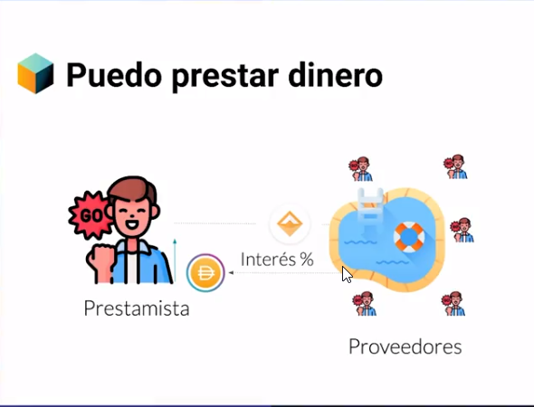

Para proveer liquidez se necesita usar una cripto como colateral y tendrá una tasa de interés estable o variable.

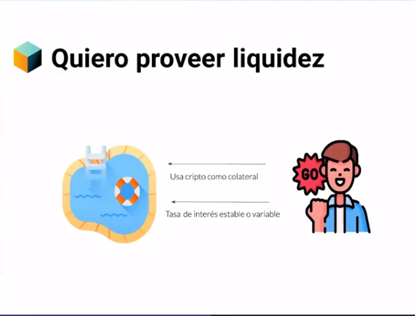

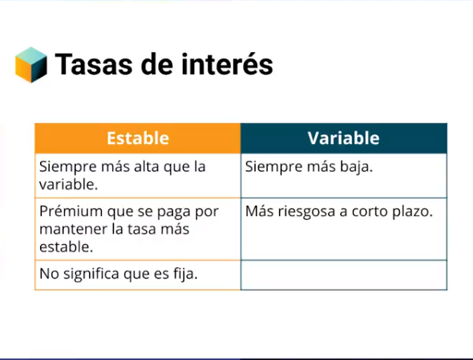

**Tasa de interés:**

- La tasa estable siempre es más alta que la variable, mientras que la variable es más baja.

- La tasa estable se paga un premium por mantener la tasa más estable, mientras que la variable es más riesgosa a corto plazo.

- La tasa estable no significa que es fija.

**Factores que afectan los porcentajes:**

- Porcentaje de utilización del pool de liquidez.

- Demanda de préstamos.

- Demanda de depósitos.

**Factores de riesgo:**

Cada criptomoneda tiene su propia evaluación de riesgo.

La evaluación de riesgo incluye varios factores.

**Health factor:**

Indica la relación entre el valor del colateral depositado y el préstamo tomado.

Que nunca llegue a 1. Lo más recomendable que esté por encima del 3 o el 4 (si teneos 25 queremos 100)

**Recomendaciones **
- Es importante constantemente revisando la salud de nuestro prestamos. 
- Lo mas imposrate es que nunca llegue a 1, es decir llegue a la paridad de lo que pedimos prestado.  
- Es mejor que este por arriba en 3 o 4 unidades, para que la volatilidad del mercado no nos afecte. 
- Ejemplo si nos prestaron 5k tengamos un poco mas. 

**Factores que afectan los porcentajes:**

- Porcentajes de utilización del pool de liquidez.
- Demanda de préstamos.
- Demanda de depósitos.

## Enlaces 
- https://chain.link/
- https://compound.finance/
- https://docs.aave.com/aavenomics/
- https://docs.aave.com/developers/guides/flash-loans
- https://docs.aave.com/portal/

## Navegando en Aave

- Precaución: Antes de entrar a cualquier protocolo asegúrate que estas entrando al link correcto.
- Para ingresar a estas herramientas necesitaras una wallet como Meta Mask.

- Formas de inversión:

- Deposit: El APY es el interés ganado en el año.
- Interés de préstamo estable: APY es el interés anual (Es más que por depositar)
- Interés de préstamo variable: APY es el interés anual (Es más que por depositar, pero menos que interés estable)

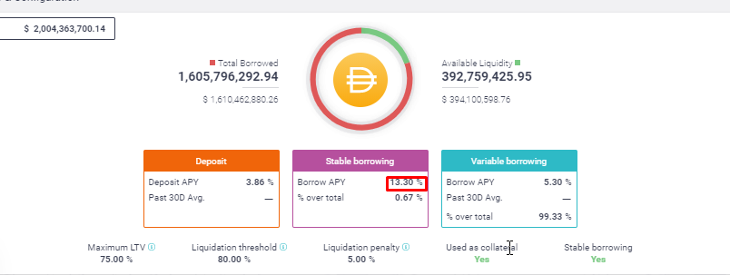

### Enlace 
- https://app.aave.com/markets --> Lugar oficial para invertir 
- https://pancakeswap.finance/farms -> Lugar para invertir pero como usuario Binance  

## Liquidity pools vs. order books

**¿Qué es un order book?**

Es un espacio en el que hay un libro de ordenes de compra y venta dentro de en un mercado.

Es regulado con un market maker detrás.

**¿Qué es un market maker?**

Es un bróker que puede ser una persona, una institución o algunas organizaciones que proveen la liquidez tanto de oferta y demanda para que el mercado funcione.

**¿Cómo fue evolucionando el concepto de los market makers?**

- Inició con la propuesta de la super computadora de Ethereum.

- Con el boom de las ICO aparece Bancor y luego Uniswap que mejoró sobre el concepto anterior.
A día de hoy cambia el paradigma de los order books.

**Pools de liquidez**

Es un conjunto de fondos depositados a proporcionar liquidez en una moneda, una red o un contrato inteligente

Proporcionar liquidez se refiere a la capacidad de depositar dentro de un espacio.

### Enlace  
- https://www.youtube.com/watch?v=42ksSu5ohak&ab_channel=CryptoSheinix -> Perdida impermanente  de DFI 

> PD Si eres proveedor de liquidez entra a la piscina de liquidez que tenga una alta liquidez y un alto volumen para recibir mayores beneficios.

## Yield Farming y Yearn Finance

** Yield Farming => Agricultura de rendimiento **
- Es la cosecha de recompensas por aportar liquidez a un proyecto.
- La liquidez es la sangre de los protocolos, así que si tu apoyas X proyecto, serás recompensado con el token del mismo, que en la mayoría de ocasiones, te dan derecho a la gobernanza.
- Es la manera de ganar mas crypto con prestar mis crypto a terceros.

** Yearn Finance => Anhelar finanzas **
- Es la manera de ganar mas crypto pero depositandolos en Vaults para que alguien mas los maneje e invierta.

## Bovedas 

- https://yearn.finance/ -> Plataforma lider para Yield Farming 
- https://app.uniswap.org/#/swap -> 
- https://app.beefy.finance/#/
- 

## Glosario de Terminos 

[Glosario de Terminos](./info/glosariocursodefi.pdf)

## Gestión y almacenamiento DeFi

**Queso es MetaMask ** 

- Es la primera Wallet que iniciaron con este movimiento. 

- Más que decirle wallet hay que recodar que son llaveros digitales donde posees una llave privada y publica

- Los llaveros no almacena los activos y estas llaves te permiten interactuar donde si están almacenados los activos que es el blockchain,

- Nunca tienes posesión de los activos solo tiene posesión de la llave publica y tu llave privada      

- Te permite interactuar con Ethereum,  Solana, Binance

- Debes guardar las frases semillas si las pierdes puedes perder tu dinero, 

- Nunca nunca compartas tus frases semillas 

- Sugerencia crear varias cuentas en diferentes wallet perode manera organizada

** Como paso este dinero Fisico a Wallet **

- Depende de la moneda de donde tomas el origen de este valor 

- Fiat to room -> Metamask te permite una forma directa por medio de transacción. 

- MetaMask es una aplicacion descentralizada la puedes encontrar en google play / Ihpone store

- Usas *Transak* que es una principal plataforma para comprar criptomonedas en el mundo. 

- [Link Explicando en Celular](./info/PasosParaComprarCritptoEnTuMonedaLocal.webm)

- [Link Explicando en Navegador](./info/PasosParaAbrirCuentaMetaMaskEnNavegador.webm)

## Plataformas de gestión de activos DeFi

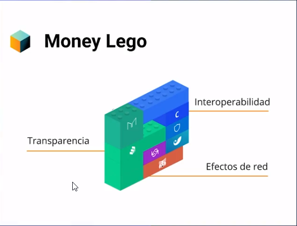

> Zerion 
- Es la forma más sencilla de crear y administrar toda su cartera de DeFi desde un solo lugar. 
- Enlace  https://zerion.io/ 
- Manera de manejar nuestras inversiones usando protocolo  DEFI
- Usas MetaMask

> instadapp.io
- La plataforma más avanzada del mundo para comenzar a aprovechar todo el potencial de las finanzas descentralizadas.
- Cree casos de uso atractivos y monetice sus modelos para ganar dinero sirviendo a sus usuarios con alta confiabilidad.
- Enlace https://instadapp.io/

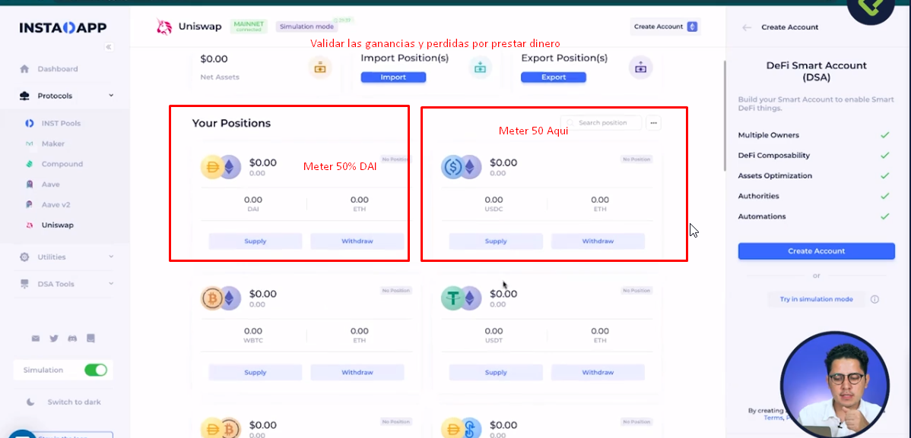

## Tips de seguridad para el manejo de wallets

>Tips 
- Utiliza  gestores de contraseñas : Myki o 1Password 
- Crea Varias carteras de MetaMask y cuentas Sugiere crear cuentas principal, variables y pruebas
- No firmes transacciones que no estas seguro como interactuar (Darger, Warning) NO FIRMES SI NO CONOCES EL CONTRATO
- tips personal: Estudia bien lo que vas invertir pegunta ante en un grupo de cofianza, habla con gente experta como el profesor del curso para salir de dudas
- Antes de hacer un gran movimiento asegurate de tener todo bajo control (Emociones, Dinero, estar tranquilo y calmado)

## Inversión: características y objetivos

> Que es una trading  
- 

> Que es una Ahorro 

> Que es inversión  

## Sesgos cognitivos

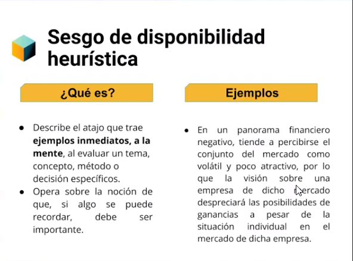

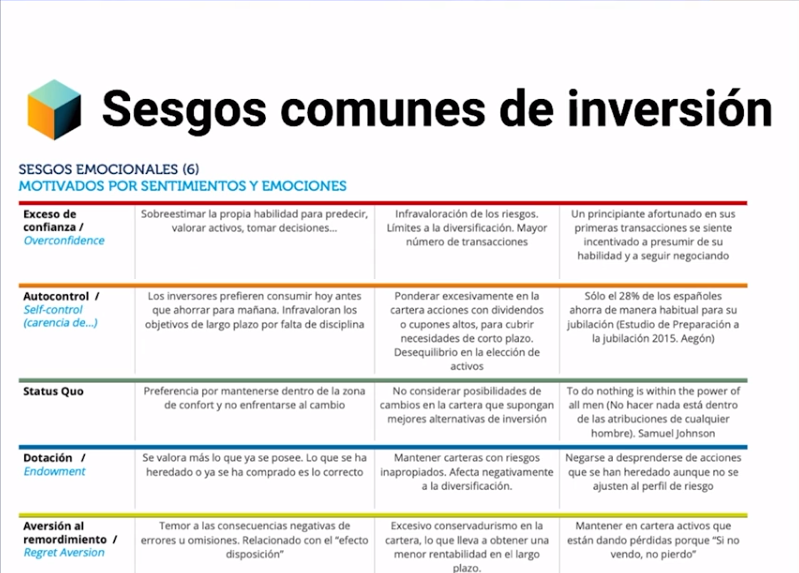

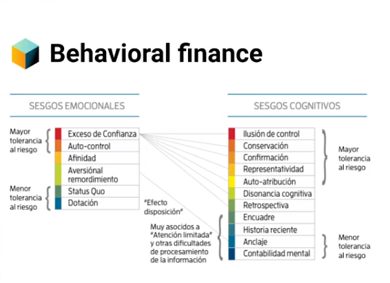

> Datos para armar tu portafolio de inversión 
- Funcionamiento DeFi
- Gestion de Riesgos DeFi
- Comportamiento financiero DeFi  

## Libros recomendados 

- Autor: Richard Thaler -> Todo lo que he aprendido con la psicología económi
- Autor: Richard Thaler -> Un pequeño empujón
- Autor: Richard Thaler -> Nudge: Improving Decisions About Health, Wealth, and Happiness

## ¿Qué es un portafolio de inversión?

>Es un conjunto de diversos de elementos financieros seleccionados y administrados con fundamentos solidos. 
  
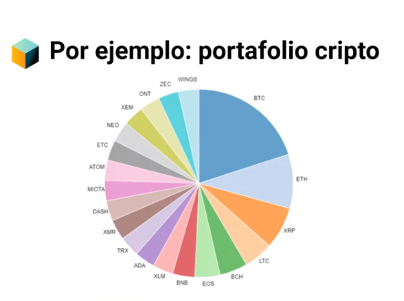

## Gestión de riesgos

> Principales Riesgos 

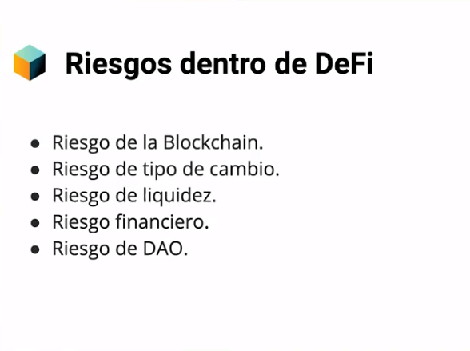

> Riesgo por la BlockChain

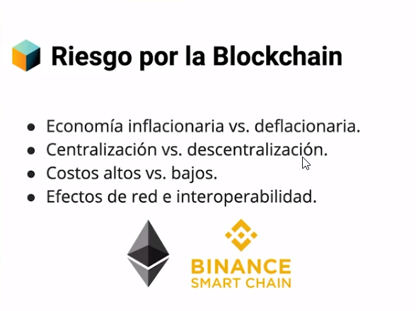

> Riesgo Cambiario 

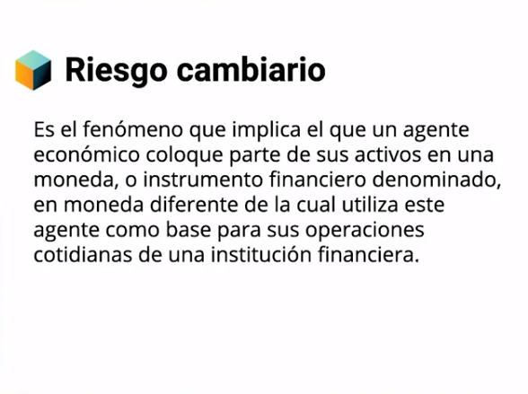
 

> Riesgo Liquidez

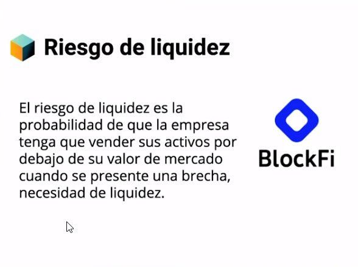

> Riesgo Financiero

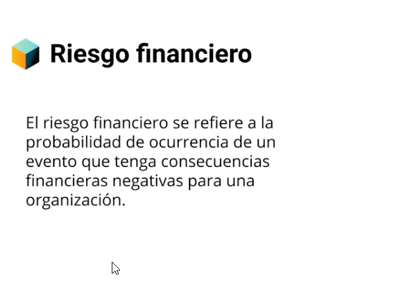

> Riesgo DAO

- Es unico de los riesgos que estan unicamente retribuidos a la tecnologia blockchain.
- DAO son las organizaciones autonomas decentralizadas que mantienen a flote la tecnologia blockchain.
- Ejemplo Verano 2020 Se crea una red y esta colapsa luego que su fundador vendiera todos los tokens. (Accidente de SuchiSwap)

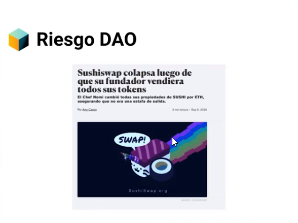

## DAO 

> Que es un DAO 
- Un sistema organizados
- Un componentes tecnologico
- Un token 

- https://es.cointelegraph.com/ethereum-for-beginners/what-is-dao

## Arma tu portafolio de inversión

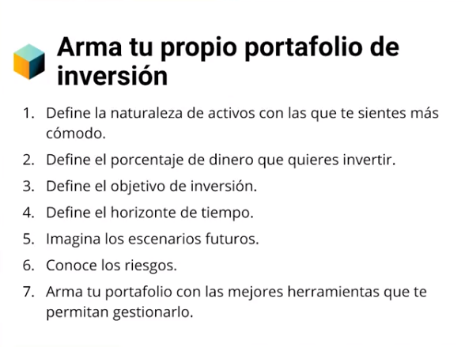
