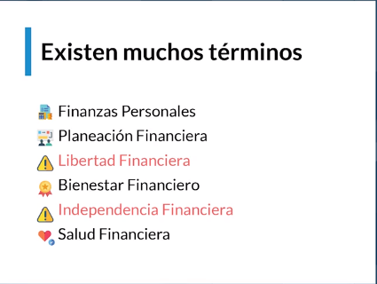
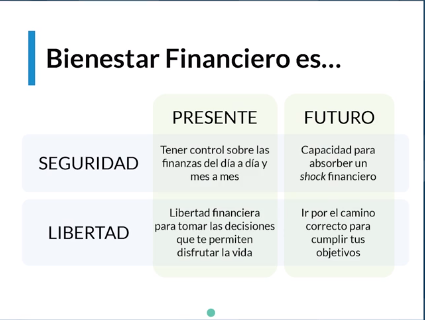
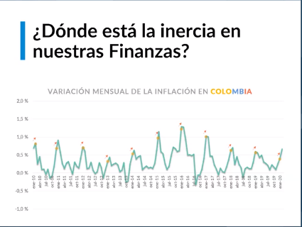
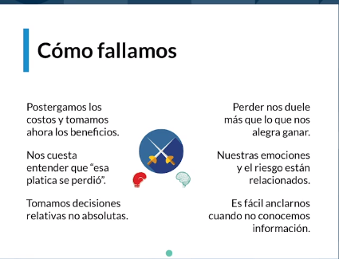

# Curso de Finanzas Personales

## Clase 1  - Cuándo y cómo tomamos decisiones financieras

> Presentación de Juan Camilo González, profesor de finanzas personales 
 

## Clase 2 - ¿De qué hablamos cuando decimos finanzas personales y educación financiera?

## Clase 3 - Por qué fallamos en nuestras finanzas personales: el papel de la inercia

>Siempre hay que encontrar nuestra inercia en el tiempo

## Clase 4 - Evaluación de porque fallamos 
> Test de Racionalidad 
Series de preguntas para validar como manejas situaciones financieras 

## Clase 5 - Poque fallamos 
> Aqui en esta clase se evalua el resultado de las preguntas con el proposito de saber que racional o irracional soy 
Saque 1 de 8 Puntos. 
**Tips**
- No tiene nada que ver con bueno o malo.  
- Somo muy miopes en el tiempo. 

**Resumen** 

- Todos somos conscientes de las decisiones correctas que deberíamos tomar para un Bienestar Financiero sin embargo a veces fallamos. Esto sucede porque nuestro cerebro ha desarrollado Mecanismos Biológicos para “facilitar” nuestra vida, pero estos no siempre son los correctos.

- Las decisiones irracionales que tomamos son “errores cognitivos” y estos son un ejemplo de ellos:

- Miopía Intertemporal Preferimos la satisfacción inmediata en lugar de la espera de una satisfacción mayor o mejor.

- Exceso de Confianza Creemos que somos buenos pronosticando pero no es así. Tendemos a tomar decisiones basadas en instinto en lugar de información.

- Costos Hundidos Tenemos apego emocional a compras/decisiones del pasado que nos impiden ser racionales a lo que nos conviene en nuestro futuro.

- Efecto Contraste A veces elegimos algo basándonos en comparativas banales pero emocionales. No estamos seguros si queremos algo hasta que que alguien más lo tiene.

- Ilusión de Control Creer que somos capaces de controlar algo de lo que objetivamente es imposible. Como el azar o la suerte.

- Sesgo de Resultado Tendemos a valorar las decisiones en virtud del resultado. Un mal resultado no significa que hubo una mala decisión y viceversa. Debemos valorar las decisiones que tomamos y el proceso que hubo detrás de cada una.

- Sesgo de Acción Actuar demasiado rápido ante situaciones nuevas de las que aún no tenemos suficiente información y después valorar nuestras acciones en base al resultado. (Sesgo de Resultado)

- Sesgo de Omisión Decidir NO actuar ante una situación por creer que al no hacer nada habrá menos consecuencias que si hacer algo.

- Aversión a la Perdida La carga emocional de perder es mayor a la de ganar. Por lo que tomaremos decisiones “seguras” por miedo a perder.

- Aversión al Riesgo Experiencias negativas de nuestro pasado nos condicionas a las decisiones que tomamos y preferimos elegir las más seguras.

- Efecto Ancla Cuando queremos darle el “precio justo” a un producto no siempre lo hacemos de manera objetiva. Si no sabemos nada del producto y alguien más nos da su opinión del “precio justo” es posible que nuestra mente se quede con esa idea en lugar de confirmar o racionalizar su valor.

## Clase 6 - Conceptos básicos que es importante entender antes de empezar a tomar buenas decisiones financieras

## Clase 7 - Formas de evaluar nuestra situación financiera

> Factores que debo tener en cuenta para evaluar mi situación financiera:

- Mi entorno socio-economico
- Mi personalidad y actitudes
- La forma en que se presentan las decisiones. Contextos de decisión.
- Conocimiento y habilidades.

> Formas de Evaluar mi estado Financiero
  - Subjetiva: Sujeta al nivel de satisfacción personal, las creencias, nociones inconscientes y a Guiones mentales de dinero.
  - Objetiva: Relacionada con los ingresos, bienes, deudas y patrimonio que me pertenece.
  - Relativa: Cómo y con quién me comparo.
  
**SUBJETIVA**
- Nivel de satisfacción personal.
- Creencias
- Aprendizajes Inconscientes
- Guiones Mentales de Dinero

**OBJETIVA**
- ¿Cuál es mi ingreso ?
- ¿Que bienes tengo?
- ¿Cuánta deuda he acumulado?
- ¿Cuánto patrimonio tengo?

**RELATIVA**
- Cómo me comparo
- Con quien me comparo  

`Saber no significa hacer o creer`
