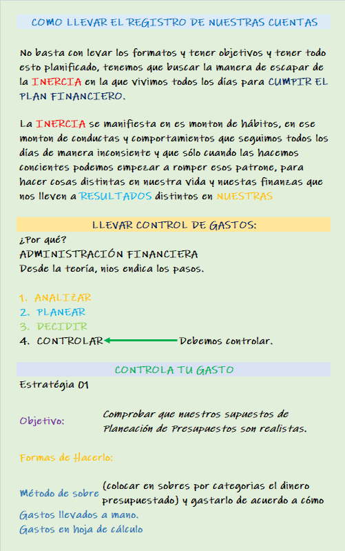

# Curso de Finanzas Personales
Maestro -> Juan Camilo González  @MisFinanzasCo

## Clase 1  - Cuándo y cómo tomamos decisiones financieras

> Presentación de Juan Camilo González, profesor de finanzas personales 
 

## Clase 2 - ¿De qué hablamos cuando decimos finanzas personales y educación financiera?

## Clase 3 - Por qué fallamos en nuestras finanzas personales: el papel de la inercia

>  La inercia, asi como muchos eventos de la física pueden er muy predecibles, 
los hábitos financieros y de consumo de los humanos son igualmente de predecibles. 

Es por esta razón que debemos hacer un analisis y una evaluación crítica de esos eventos 
anticipados y responder frente a ellos de una manera eficiente

>Siempre hay que encontrar nuestra inercia en el tiempo

Notas: No solo basta con tomas decisiones, hay que ver como se toman esas decisiones. 

## Clase 4 - Evaluación de porque fallamos 
> Test de Racionalidad 
Series de preguntas para validar como manejas situaciones financieras 

## Clase 5 - Poque fallamos 
> Aqui en esta clase se evalua el resultado de las preguntas con el proposito de saber que racional o irracional soy 
Saque 1 de 8 Puntos. 
**Tips**
- No tiene nada que ver con bueno o malo.  
- Somo muy miopes en el tiempo. 

**Resumen** 

- Todos somos conscientes de las decisiones correctas que deberíamos tomar para un Bienestar Financiero sin embargo a veces fallamos. Esto sucede porque nuestro cerebro ha desarrollado Mecanismos Biológicos para “facilitar” nuestra vida, pero estos no siempre son los correctos.

- Las decisiones irracionales que tomamos son “errores cognitivos” y estos son un ejemplo de ellos:

- Miopía Intertemporal Preferimos la satisfacción inmediata en lugar de la espera de una satisfacción mayor o mejor.

- Exceso de Confianza Creemos que somos buenos pronosticando pero no es así. Tendemos a tomar decisiones basadas en instinto en lugar de información.

- Costos Hundidos Tenemos apego emocional a compras/decisiones del pasado que nos impiden ser racionales a lo que nos conviene en nuestro futuro.

- Efecto Contraste A veces elegimos algo basándonos en comparativas banales pero emocionales. No estamos seguros si queremos algo hasta que que alguien más lo tiene.

- Ilusión de Control Creer que somos capaces de controlar algo de lo que objetivamente es imposible. Como el azar o la suerte.

- Sesgo de Resultado Tendemos a valorar las decisiones en virtud del resultado. Un mal resultado no significa que hubo una mala decisión y viceversa. Debemos valorar las decisiones que tomamos y el proceso que hubo detrás de cada una.

- Sesgo de Acción Actuar demasiado rápido ante situaciones nuevas de las que aún no tenemos suficiente información y después valorar nuestras acciones en base al resultado. (Sesgo de Resultado)

- Sesgo de Omisión Decidir NO actuar ante una situación por creer que al no hacer nada habrá menos consecuencias que si hacer algo.

- Aversión a la Perdida La carga emocional de perder es mayor a la de ganar. Por lo que tomaremos decisiones “seguras” por miedo a perder.

- Aversión al Riesgo Experiencias negativas de nuestro pasado nos condicionas a las decisiones que tomamos y preferimos elegir las más seguras.

- Efecto Ancla Cuando queremos darle el “precio justo” a un producto no siempre lo hacemos de manera objetiva. Si no sabemos nada del producto y alguien más nos da su opinión del “precio justo” es posible que nuestra mente se quede con esa idea en lugar de confirmar o racionalizar su valor.

## Clase 6 - Conceptos básicos que es importante entender antes de empezar a tomar buenas decisiones financieras

## Clase 7 - Formas de evaluar nuestra situación financiera

> Factores que debo tener en cuenta para evaluar mi situación financiera:

- Mi entorno socio-economico
- Mi personalidad y actitudes
- La forma en que se presentan las decisiones. Contextos de decisión.
- Conocimiento y habilidades.

> Formas de Evaluar mi estado Financiero
  - Subjetiva: Sujeta al nivel de satisfacción personal, las creencias, nociones inconscientes y a Guiones mentales de dinero.
  - Objetiva: Relacionada con los ingresos, bienes, deudas y patrimonio que me pertenece.
  - Relativa: Cómo y con quién me comparo.
  
**SUBJETIVA**
- Nivel de satisfacción personal.
- Creencias
- Aprendizajes Inconscientes
- Guiones Mentales de Dinero

**OBJETIVA**
- ¿Cuál es mi ingreso ?
- ¿Que bienes tengo?
- ¿Cuánta deuda he acumulado?
- ¿Cuánto patrimonio tengo?

**RELATIVA**
- Cómo me comparo
- Con quien me comparo  

`Saber no significa hacer o creer`

## Clase  10 -> Cómo evaluar objetivamente nuestra situación financiera habla de activo y pasivo 

**NOTA PERSONAL**
Si bien cada profesional tiene una definición diferente (que no la hace errónea o correcta) de lo que es un activo y un pasivo, yo prefiero las siguientes definiciones:

Pasivo: todo lo que saca dinero de mi bolsillo. Un crédito (cuota de manejo, intereses…), un automóvil (mantenimiento, gasolina, seguros, impuestos…), la vivienda que habito (impuestos, mantenimiento, cuotas del crédito - de ser el caso-)…
Activo: todo lo que pone dinero en mi bolsillo. Una inversión, acciones de una empresa, mi propio negocio, un automóvil que tengo trabajando como Uber (por ejemplo), una vivienda que arriendo a alguien, un crédito que extendí a alguien y por el cual me pagan intereses…
Los palos de golf que tengo en el garaje acumulando polvo y que en una emergencia podría vender no es un activo ni un pasivo, en simplemente parte de mi patrimonio. Y contrario a la creencia popular, la viviendo donde habitamos, es un pasivo porque nos quita dinero, aún si ya la hemos pagada. Hagan el ejercicio mental, se quedan sin trabajo y lo primero que pierden es la vivienda por no pagar las cuotas o necesitan venderla porque no pueden con los impuestos y los gastos asociados. Algo así no puede ser un activo nunca en la vida (que le duela a quien le duela).

**Habla de activos y pasivos**

## Clase 20 ->  Cómo llevar el registro de nuestras cuentas

> Compañeros yo quisiera comentarles el método que a mi me sirvió:
la verdad sin que andie me lo hubiera enseñado yo apliqué el metodo de los sobres pero con variaciones, Yo soy estudiante universitario y no tengo un sueldo, sin embargo vendo gomitas en la universidad y hago domicilios en medellín de cajas personalizadas @gomitasdeJuancho, y aparte de eso tengo la fortuna de recibir una mesada de 20 mil pesos semanales, así que me obligue a pasar 2 semanas sin ningún gasto, ya horrando mi mesada y las utilidades que me generó mi negocio esas dos semanas, luego de restarle los gastos operativos, eso fue hace ya bastante tiempo, en esas dos semanas logré ahorrar 70 mil pesos, y esos 70 los reparti en 6 conceptos: “Ahorro”, “Ocio”, “Deudas”, “Inversión”, “Amigos” y “Lujos”.
Tú puedes repartirlos en los conceptos que más te gusten, o los que consideres necesarios, 70/6 = 11600 pesos.
Y durante la siguiente semana, yo tuve para mis gastos en la universidad como comida y uno que otro postre por ahí unicamente 11600 pesos, y si entre semana ya me los había gastado, entonces ya no podía comprarme más comida durante esa semana, y cuando pasó, yo me obligaba a pasar hambre hasta que terminara la semana y nuevamente volvía a agregarle a cada concepto mi mesada más las utilidades que me generaba mi negocio. y me ayudo mucho a controlar mis gastos. No te estoy diciendo que este es el mejor método que existe, pero a mi me sirvió y espero puedas adaptarlo a tus necesidades, hacerle los cambios que consideres necesario y empezar a aplicarlo cuando puedas. a diferencia de los sobres, yo cuento con una “Discplina” increible y no necesitaba tener la plata separada o en un sobre para saber que me quede sin dinero en ese sobre, yo llevaba mis gastos sagradamente y aunque en mi billetera hubiera dinero, si yo sabia que ya me había gastado la plata para ese tipo de concepto, yo hacia de cuenta que mi billetera estaba vacia, ya depende de tu fuerza de voluntad. Mucha suerte!!

## Clase 21 -> Crear mecanismos de compromiso -> 2da  Estretegia

## Clase 22 -> Crear holgura -> 3era  Estretegia 

**Crear holgura**
- Gastando lo que te queda después de ahorrar en lugar de ahorrar lo que te queda después de gastar (mejor si es automáticamente)
- Presupuestando gastos moderadamente inflados.
- Presupuestando ingresos en un escenario em el flujo de caja (10% para empezar)
- Nunca copar nuestros límites de endeudamiento

> Como dijo Robert Kiyosaki, si aumentan nuestros ingresos, aumentan nuestros gastos. Entonces tener más dinero no siempre es la solución a nuestros problemas, es la falta de educación financiera.
> Les recomiendo leer sus libros sobre finanzas.
También para el tema de comprar muchas cosas, busquen el estilo de vida de las personas minimalistas, yo estoy lentamente adoptando esta manera de vivir y mis gastos se redujeron de manera drástica, hay un documental en netflix, se llama “minimalismo”, se los recomiendo bastante.

## Clase 23 -> Identificar y realizar ajustes a tiempo -> 4ta Estretegia 

**Recuerda**
- La planeación Financiera no se trata de hacer las cosas “bien”.
- La incertidumbre hace parte de nuestra vida, aprendemos a gestionarla.
- El mejor plan es el que es flexible, aquel nos permite hacer ajustes de la manera más rápida y menos “dolorosa” posible.
- Entre más simple, mejor: cuida tu ancho de banda mental.

**Posibles ajustes:**
- Test de desvanecimiento de opciones
- Tener al menos dos escenarios (pre-morten)
- Mover flujos
- Reestructurar pasivos
- Vender activos
- Crear nuevas fuentes de ingreso.
- Pedir ayuda.

## Clase 23 -> Seguir creciendo en nuestra Educación Financiera

**Resumen de estrategias:**

- El recurso más valioso no es el dinero es el tiempo
- Enfocarnos en encontrar nuestro Bienestar Financiero
- Saber siempre nuestros Costos de Oportunidad al momento de tomar decisiones.
- Evaluarnos constantemente de manera Objeta, Subjetiva y Relativa.
- Ser realistas y congruentes al momento de compararnos.
- Enfocarnos en nuestro flujo de caja.
- Darle prioridad al ahorro y la inversión sobre el pago de deudas.
- Tener objetivos y anticiparnos a las sorpresas y emergencias.
- El recurso más valioso ES EL TIEMPO (x2)

Aquí les dejo los enlaces de las sugerencia para mantenerse al día:
Carl Richards -> https://www.nytimes.com/by/carl-richards
Sonia Sánchez-Escuer -> https://www.blogylana.com/
Querido dinero -> https://www.queridodinero.com/
Argentarium -> https://www.argentarium.com/
Jason Butler -> https://www.ft.com/jason-butler

**Si quieres leer… Libros recomendados para seguir creciendo en nuestra educación financiera**

- El triunfo del dinero - Niall Ferguson
- Your Money or Your Life - V Robin
- Mind over Money - Bargain Price
- El inversor inteligente - Benjamin Graham
- Pound Foolish - Helaine Olen
- Barking Up the Wrong Tree - Eric Barker
- Happiness by Design - Paul Dolan

